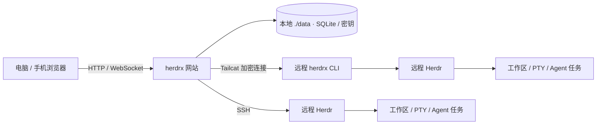

<p align="center">
  
</p>

<h1 align="center">herdrx</h1>

<p align="center">
  <strong>自托管、多用户的 Herdr 远程终端工作台</strong>
  <br />
  在电脑和手机上连接多台主机，继续同一组工作区、分屏终端与 Agent 任务。
</p>

<p align="center">
  <a href="https://github.com/riba2534/herdrx/actions/workflows/ci.yml"></a>
  <a href="https://github.com/riba2534/herdrx/releases"></a>
  
  
  
  <a href="https://github.com/riba2534/herdrx/stargazers"></a>
  <a href="LICENSE"></a>
</p>

<p align="center">
  <a href="#herdrx-是什么">介绍</a> ·
  <a href="#功能总览">功能</a> ·
  <a href="#快速开始">快速开始</a> ·
  <a href="#接入远程主机">接入主机</a> ·
  <a href="#系统架构">架构</a> ·
  <a href="#配置与数据">配置</a> ·
  <a href="#开发与贡献">开发</a> ·
  <a href="#常见问题">FAQ</a>
</p>

---

## herdrx 是什么

herdrx 是 [Herdr](https://herdr.dev/) 的 Web 客户端。它将多台主机的终端工作区汇集到一个页面：查看 Agent 状态、切换 Tab 和 Pane、操作分屏终端，也可以在手机上接着处理任务。

**Herdr 和任务独立运行在远程主机上。** 关闭浏览器、退出账号、重启网站，或网站所在机器离线，只会断开访问；重新进入后连接原有会话，不重建任务，也不补发断线期间未确认的输入。远程主机自身的重启与任务恢复由 Herdr 和任务管理器负责。

网站使用 Go 单进程承载 API、WebSocket 和 React 页面，SQLite 保存账号与主机配置。适合个人和可信小团队，采用单实例部署。本文把部署网站的机器称为**工作台主机**，把运行 Herdr 与任务的机器称为**远程主机**。

当前版本为 [v0.1.0-rc.1](https://github.com/riba2534/herdrx/releases/tag/v0.1.0-rc.1)，属于预发布。持续运行与真实设备、跨运营商网络验收仍在推进，范围见[发布说明](docs/releases/v0.1.0-rc.1.md)。

## 功能总览

| 模块 | 能力 |
|---|---|
| 多主机 | SSH、Tailcat、本机 Herdr；按名称和地址搜索，使用文件夹及子文件夹组织 |
| 工作台 | 保留 Herdr 的工作区 → Tab → Pane 层级、BSP 分屏和 Agent 状态 |
| 终端 | xterm 二进制流、历史滚动、全屏 TUI、中文输入、Shift+Enter、输入背压 |
| 图片 | 粘贴、拖入或上传 PNG/JPEG/WebP/GIF，单张最大 20 MB；交给对应远程终端 |
| 跨端显示 | 桌面分屏、手机单终端、辅助键条、字号与缩放；显示调整不改变远程终端尺寸 |
| 外观 | 网站浅色、工作台 Cobalt 深色，两部分独立切换；7 套独立终端配色 |
| SSH 密钥 | 导入或生成密钥、加密私钥口令、用户证书；多台主机复用账号内的密钥 |
| 账号与权限 | 首位管理员初始化、默认关闭注册、邀请注册、用户禁用、登录撤销和审计 |
| 通知与 PWA | 浏览器安装、离线提示、手动确认更新、页面关闭后的 Web Push；按浏览器能力启用 |
| CLI 运维 | systemd 用户服务、一次性绑定、网络诊断、签名更新、回滚和撤销 |
| 部署 | Linux amd64/arm64 Docker 镜像、默认 HTTP、nonroot、本地目录持久化 |

图片上传后不会自动按回车。支持附件的 Agent 可以读取图片，普通 Shell 收到的是文件路径。SSH 密钥与文件夹操作见[使用说明](docs/ssh-keys-and-folders.md)。

## 快速开始

工作台主机需要 Linux、Docker Engine 和 Docker Compose 插件。远程主机需要提前安装并运行 Herdr；网站不会代管 Herdr 的安装、升级或任务生命周期。

### 1. 准备配置

```bash
git clone --depth 1 --branch v0.1.0-rc.1 https://github.com/riba2534/herdrx.git
cd herdrx
cp deploy/.env.example deploy/.env
sudo bash deploy/prepare-data.sh
```

编辑 `deploy/.env`，将 `HERDRX_PUBLIC_URL` 改成浏览器实际访问的地址。同机访问可以使用：

```dotenv
HERDRX_PUBLIC_URL=http://localhost:8080
HERDRX_COOKIE_SECURE=false
```

默认只提供 HTTP，不需要域名或证书。通过局域网访问时，填写工作台主机的实际 IP；需要 HTTPS 时，可以接入自己的反向代理，见[运维说明](docs/operations.md#https)。

### 2. 启动网站

**已有镜像：** 将 `HERDRX_IMAGE` 配置为自己仓库中已发布的镜像，例如 `registry.example.com/herdrx/server:latest`，登录对应镜像源后启动：

```bash
docker login registry.example.com --username herdrx-pull
docker compose --env-file deploy/.env -f deploy/compose.yml pull
docker compose --env-file deploy/.env -f deploy/compose.yml up -d --wait
```

**从源码构建：** 没有镜像源时，直接使用构建叠加配置。Go 和 Node.js 都在构建容器中运行：

```bash
docker compose --env-file deploy/.env \
  -f deploy/compose.yml -f deploy/compose.dev.yml up -d --build --wait
```

生产 Compose 只拉镜像；`compose.dev.yml` 才启用源码构建。本项目通过 GitHub Actions 向维护者配置的 ZOT 发布网站镜像，私人镜像地址和凭据不写入公开仓库。自行维护镜像源的流程见[构建与镜像发布](docs/deployment.md)。

### 3. 创建管理员

```bash
sudo cat deploy/data/bootstrap-token
```

打开配置的地址，用初始化令牌创建管理员。初始化后令牌文件自动删除，注册默认关闭。需要其他账号时，由管理员开启邀请注册并创建邀请码。

## 接入远程主机

### SSH

在网站「添加主机」中选择 SSH，填写从工作台主机出发可访问的地址、端口与用户名，选择密码或密钥认证。首次连接需要核对远程主机的 SSH 指纹。

远程用户必须能运行 Herdr，sshd 需要允许 Unix socket 转发；全屏应用滚动还需要 `python3`。可以先在「密钥」页导入已有私钥，供多台主机复用。完整步骤见[安装说明](docs/install.md)。

### Tailcat 内网穿透

Tailcat CLI 支持 Linux x86_64 / ARM64。在网站选择「添加主机 → Tailcat 内网穿透」，按三步引导完成安装、后台运行和绑定。

在远程主机上、以运行 Herdr 的同一用户执行：

```sh
(
  set -eu
  installer=$(mktemp)
  trap 'rm -f "$installer"' EXIT
  curl -fL --proto '=https' --proto-redir '=https' \
    https://github.com/riba2534/herdrx/releases/download/v0.1.0-rc.1/install-herdrx.sh \
    -o "$installer"
  sh "$installer" --version v0.1.0-rc.1
) &&
export PATH="$HOME/.local/bin:$PATH" &&
herdrx version
```

然后检查 Herdr 和后台服务，生成一次性绑定凭据：

```sh
herdrx setup && herdrx status
loginctl show-user "$(id -un)" --property=Linger
herdrx connect --plain
```

`Linger` 应为 `yes`；否则按[教程](docs/tailcat-quickstart.md#2-配置后台运行)启用后台保活。将 `connect` 输出粘贴到网站即可绑定；这段凭据 10 分钟内有效、只能使用一次，请勿公开分享。

也可从 [GitHub Release](https://github.com/riba2534/herdrx/releases/tag/v0.1.0-rc.1) 手动下载两个架构的压缩包、校验和及离线教程。网页根据已发布且附件完整的版本生成安装命令；RC 使用固定版本号，不依赖 `latest`。

## 系统架构



网站、CLI 和 Herdr 各自承担不同职责。更新网站镜像只更新工作台；更新 CLI 只重启对应的访问服务。两条操作都保留远程 Herdr 的会话和任务。

发布由两条独立流水线完成：`main` 推送验证并发布双架构网站镜像到 ZOT，版本标签构建、签名并发布 CLI 到 GitHub Release。工作台主机自行拉取镜像，CI 不自动登录用户机器部署。

## 配置与数据

完整配置见 [deploy/.env.example](deploy/.env.example)，常用选项如下：

| 变量 | 默认值 | 用途 |
|---|---|---|
| `HERDRX_IMAGE` | 必填 | 部署使用的镜像标签或 digest |
| `HERDRX_BIND_ADDR` / `HERDRX_PORT` | `0.0.0.0` / `8080` | 宿主机监听地址与端口 |
| `HERDRX_PUBLIC_URL` | `http://127.0.0.1:8080` | 浏览器实际访问地址 |
| `HERDRX_COOKIE_SECURE` | `false` | 使用 HTTPS 时设置为 `true` |
| `HERDRX_MAX_HOST_CONNECTIONS` | `20` | 全实例已连接及待连接主机上限 |
| `HERDRX_HOST_DIAL_CONCURRENCY` | `4` | 同时拨号数，避免慢主机拖住其他连接 |
| `HERDRX_TRUSTED_PROXIES` | 空 | 可信代理 IP/CIDR；直连保持为空 |
| `HERDRX_ALLOWED_ORIGINS` | 空 | 可选站点别名，填写完整 origin |
| `HERDRX_SESSION_TTL` | `720h` | Web 登录有效期 |

所有运行数据都使用可见的 bind mount，默认保存在 `deploy/data/`，没有 Docker 命名卷或匿名卷。网站以 `65532:65532` 运行；使用 `prepare-data.sh` 初始化权限，不要改成 `chmod 777`。备份需同时保留 SQLite、`master.key` 和 VAPID 身份，步骤见[数据与备份](docs/operations.md#数据与备份)。

主机、密钥、文件夹与绑定按用户隔离；本机 Herdr 仅管理员可用。实例管理员能够接触终端内容和解密后的连接凭据，请将工作台部署在可信环境。

更新网站前先备份，再执行 `docker compose pull` 和 `docker compose up -d --wait`；更新 CLI 使用 `herdrx update --version TAG`，回退使用 `herdrx rollback`。数据库兼容、签名验证和恢复边界见[更新与恢复](docs/update-and-recovery.md)。

## 开发与贡献

工具链：Go 1.27.1、Node.js 26.4.0、pnpm 11.25.0。

```bash
pnpm --dir web install --frozen-lockfile
make web-build
go run ./cmd/herdrx-server
```

网站默认监听 `127.0.0.1:8080`。前端资源由 `make web-build` 生成并嵌入网站二进制，不提交编译产物；CLI 可单独执行 `go build ./cmd/herdrx`。

```bash
go vet ./...
go test -count=1 -timeout=10m ./...
go test -race -count=1 -timeout=10m ./...
pnpm --dir web typecheck
pnpm --dir web lint
pnpm --dir web exec vitest run
python3 scripts/check-deployment.py
```

欢迎提交可复现的问题和改进。开发约定、隔离测试和目录说明见 [CONTRIBUTING.md](CONTRIBUTING.md)，Agent 项目指引见 [CLAUDE.md](CLAUDE.md)。

## 常见问题

**Docker 中如何接入宿主机 Herdr？** 使用 SSH 或 Tailcat。网站的「本机」指网站进程所在环境，容器默认不能直接读取宿主机的 Herdr socket。

**关闭网站会停止任务吗？** 远程 Herdr 与任务独立运行。网站离线期间无法查看或接收经由它发送的通知，恢复后重新连接原会话。网站与 Herdr 同机运行时，共享整机故障边界。

**SSH 是否支持跳板机和 SSH alias？** 当前支持基础 host/port/user/password/key，不解析本机 SSH alias，也不包含 ProxyJump、FIDO、GSSAPI 或 ssh-agent 转发。

**为什么手机没有安装或通知入口？** 这些能力取决于浏览器支持和安全上下文。HTTP 网站可正常使用；本机可以用 localhost 验证 PWA，真实设备是否可安装由浏览器决定。安装操作通过浏览器菜单完成。

**支持多少台主机、多副本或共享主机？** 默认最多 20 个热连接、4 个并发拨号，这是资源保护上限；实际容量取决于终端负载。当前采用单实例、每台接入记录归属一个用户，不支持 HA 或跨账号共享。测量范围见[容量记录](docs/capacity-validation-2026-09-07.md)。

## 文档

- [安装说明](docs/install.md) · [Tailcat 接入教程](docs/tailcat-quickstart.md)
- [SSH 密钥与文件夹](docs/ssh-keys-and-folders.md) · [自绘控件与提示](docs/custom-controls.md)
- [部署与镜像发布](docs/deployment.md) · [运维](docs/operations.md) · [更新与恢复](docs/update-and-recovery.md)
- [CLI 发布流程](docs/cli-release.md) · [预发布说明](docs/releases/v0.1.0-rc.1.md) · [正式版验收清单](docs/release-readiness-2026-09-06.md)

## 致谢

感谢 [Herdr](https://herdr.dev/) 提供终端工作区能力，[Tailcat](https://github.com/tailscale/tailcat) 提供连接能力，以及 React、xterm.js 和其他开源依赖。依赖声明见 [THIRD_PARTY_NOTICES.md](THIRD_PARTY_NOTICES.md)，机器可读清单见 [sbom.cdx.json](sbom.cdx.json)。

## License

[MIT](LICENSE) © 2026 riba2534。第三方依赖遵循各自许可证。
