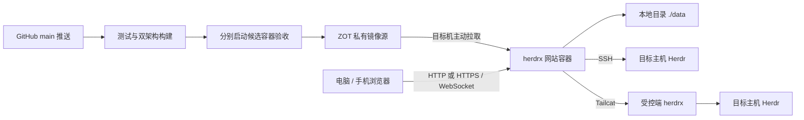

<p align="center">
  
</p>

<h1 align="center">herdrx</h1>

<p align="center">
  <strong>把多台主机上的 Herdr，放进同一个浏览器工作台</strong>
  <br />
  电脑查看任务，手机接着操作。保留工作区、Tab、Pane 和完整终端，不打断正在运行的会话。
</p>

<p align="center">
  <a href="https://github.com/riba2534/herdrx/actions/workflows/ci.yml"></a>
  
  
  
  <a href="https://github.com/riba2534/herdrx/stargazers"></a>
</p>

<p align="center">
  <a href="#herdrx-是什么">介绍</a> ·
  <a href="#功能总览">功能</a> ·
  <a href="#快速开始">快速开始</a> ·
  <a href="#接入主机">接入主机</a> ·
  <a href="#系统架构">架构</a> ·
  <a href="#配置">配置</a> ·
  <a href="#开发与测试">开发</a> ·
  <a href="#常见问题">FAQ</a>
</p>

---

## herdrx 是什么

herdrx 是 [Herdr](https://herdr.dev/) 的多用户 Web 客户端。你可以从一个页面切换多台主机，查看工作区、分屏终端和 Agent 状态，并继续操作已有会话。Herdr 留在各自主机上运行，网站负责连接和展示。

网站使用 Go 单进程承载 API、WebSocket 和内嵌的 React 页面，SQLite 保存账号与主机配置。适合个人或可信小团队自托管，当前采用单实例部署。

本文把部署 herdrx 网站的机器称为**工作台主机**，把接入并运行 Herdr 与任务的其他机器称为**远程主机**。工作台负责访问入口，远程主机负责实际运行。产品要求是：即使工作台主机整机关机或失联，远程主机上的 Herdr 和任务仍继续运行；工作台恢复后重新连接已有会话。产品边界见[最终实施方案](docs/design/auth-admin-remediation.md)；两台独立虚拟机的 SSH/Tailcat 整机故障结果见[验收报告](docs/auth-admin-validation-2026-09-06.md)。

- **多主机工作台**：本机、SSH、Tailcat 接入，按主机 → 工作区 → Tab → Pane 切换。
- **完整终端**：xterm 终端、BSP 分屏、历史滚动、中文输入、Shift+Enter 换行及图片粘贴。
- **桌面和手机共用会话**：响应式界面、移动端辅助键、PWA 和 Web Push。
- **Docker 交付**：GitHub 自动构建双架构镜像，推送 ZOT；目标机拉取镜像即可启动。
- **数据目录看得见**：数据库、密钥、代理证书都挂载到部署目录，不使用 Docker 命名卷或匿名卷。

## 功能总览

| 模块 | 主要能力 |
| --- | --- |
| 账号 | 首次管理员初始化、默认关闭注册、管理员开启邀请注册、HttpOnly 会话、CSRF 防护 |
| 主机 | 管理员专用本机 Herdr、用户自己的基础 SSH/Tailcat；重命名、连接设置、文件夹与子文件夹分组 |
| SSH 密钥 | 导入或生成可复用密钥、公钥与指纹、加密私钥口令、可选用户证书；多台主机选择同一密钥 |
| 工作台 | 工作区、Tab、Pane、Agent 状态及 BSP 分屏 |
| 终端 | 二进制终端流、背压、多浏览器输入、Herdr 保留的历史与全屏应用滚动 |
| 显示 | 10–28 px 字号、50%–200% 缩放、一键适应窗口；电脑和手机分别记忆显示偏好 |
| 图片 | 粘贴、拖入或选择 PNG/JPEG/WebP/GIF，单张最大 20 MB；上传到对应主机后交给终端 |
| 界面外观 | 网站默认白灰浅色，工作台默认 Cobalt 深色；两部分外观分别保存，点击按钮在浅色、深色之间切换 |
| 终端配色 | Cobalt2 默认主题，另有 Catppuccin Mocha、Dracula、One Dark 等共 7 套主题，与界面外观独立 |
| 移动端 | PWA、主机切换、虚拟键条及关闭页面后的 Web Push 通知 |
| 存储 | SQLite WAL、按用户隔离、AES-GCM 加密主机凭据 |
| 访问管理 | 注册开关、用户搜索与角色/状态筛选、启用/禁用、登录注销、邀请撤销及审计 |
| 部署 | Linux amd64/arm64 网站镜像、健康检查、默认 HTTP，可接自己的反向代理 |

图片粘贴不会自动按回车。支持图片的 Agent 可以将其识别为附件，普通 Shell 收到的是文件路径。浏览器能力有限时，可使用终端标题栏的上传按钮。

桌面当前终端的标题栏内，`Aa` 可以调整字号，`− / +` 调整终端缩放，点击百分比恢复 100%，「适应窗口」显示完整画面。窄分屏收起快捷缩放按钮，全部显示选项仍可通过工作台设置调整。手机默认保持 14 px 字号，单指上下滑动可浏览终端历史和全屏应用；画面放大时先平移，到边缘后继续滚动内容。点击键盘图标回到光标并输入。手机横屏保留单终端布局，可从「切换」选择其他终端，历史按钮支持翻页。显示调整只影响当前浏览器，不改变远程终端尺寸或重连会话。横向平移和浏览器双指缩放仍可使用。

SSH 可自定义用户名、端口，并选择密码或公钥认证。主机页顶部「密钥」支持导入已有私钥供多台机器复用；左侧文件夹可组织主机，删除文件夹会保留其中的主机。操作步骤见 [SSH 密钥与主机文件夹](docs/ssh-keys-and-folders.md)。

## 快速开始

目标机器需要 Linux、Docker Engine 与 Docker Compose 插件，并能访问你配置的镜像源。网站容器通过 SSH 或 Tailcat 连接 Herdr 所在主机。以下域名和账号均为示例，真实地址及凭据由实例维护者私下提供。

### 1. 准备部署目录

从成功的 GitHub Actions 运行下载 `herdrx-deploy-*` 附件，解压其中的 `herdrx-deploy.tar.gz` 到目标目录，例如 `/opt/herdrx`。也可以从源码复制这几个小文件，目标机不需要安装 Go 或 Node.js：

```bash
mkdir -p ~/herdrx-deploy
cp deploy/compose.yml deploy/.env.example deploy/prepare-data.sh ~/herdrx-deploy/
cd ~/herdrx-deploy
cp .env.example .env
sudo bash prepare-data.sh
```

编辑 `.env`，把 `HERDRX_IMAGE` 改成自己的已发布镜像，把 `HERDRX_PUBLIC_URL` 改成浏览器实际访问的地址。同机 HTTP 示例：

```dotenv
HERDRX_IMAGE=registry.example.com/herdrx/server:latest
HERDRX_PUBLIC_URL=http://localhost:8080
HERDRX_COOKIE_SECURE=false
```

默认通过 HTTP 访问，不要求域名。需要 HTTPS 时，由部署者自行配置反向代理，应用侧参数见 [HTTPS 配置](docs/operations.md#https)。

### 2. 登录镜像源并启动

使用仅有拉取权限的账号登录，密码由 Docker 交互读取：

```bash
docker login registry.example.com --username herdrx-pull
docker compose pull
docker compose up -d --wait
docker compose ps
sudo cat data/bootstrap-token
```

打开配置的地址，使用一次性 token 创建管理员；初始化完成后 token 文件自动删除。

`latest` 在首次 GitHub Actions 发布成功后才存在。每个自托管实例需要配置自己的 OCI 仓库及访问权限，或按下文在本机构建。流水线配置见 [构建与镜像发布](docs/deployment.md)。

### 3. 日常更新

先按 [运维说明](docs/operations.md#数据与备份) 备份，再在同一部署目录执行：

```bash
docker compose pull
docker compose up -d --wait
```

容器替换后继续使用原来的 `./data`。需要固定版本或回退时，将自己的仓库地址与发布记录中的 digest 组成 `image@sha256:...`，写入 `.env` 的 `HERDRX_IMAGE`，再执行相同命令。数据库兼容边界见 [更新与恢复](docs/update-and-recovery.md)。

## 接入主机

### SSH

先在目标主机安装并运行 Herdr，然后在网站「添加主机」中选择 SSH：

1. 填写从网站容器出发能访问的地址、端口和用户名。
2. 为这台主机生成独立 SSH 公钥，加入目标用户的 `~/.ssh/authorized_keys`；也可使用已有私钥或密码。
3. 核对首次连接的 host key 指纹。
4. 确保 sshd 允许 Unix socket 转发（`direct-streamlocal@openssh.com`）。

当前 SSH 接入支持基础 host/port/user/key/password，不解析本机 SSH alias，也不包含 ProxyJump、FIDO、GSSAPI 或 ssh-agent 转发。

全屏应用滚动需要 Linux Herdr 主机，基础 SSH 方式还需要远程用户可执行 `python3`。工作台只读取现有终端尺寸；支持的 Herdr 协议版本、Tailcat CLI 配套要求见[安装说明](docs/install.md#终端滚动兼容要求)。

### Tailcat

在网站选择「添加主机 → Tailcat 内网穿透」，按三步引导完成：

1. 从 [GitHub Releases](https://github.com/riba2534/herdrx/releases) 下载 Go 编写的 `herdrx` CLI，或复制页面提供的固定版本安装命令；支持 Linux x86_64 / ARM64。
2. 在远程主机以运行 Herdr 的同一用户执行 `herdrx setup && herdrx status`，并检查 `Linger=yes`，配置开机与 SSH 登出后的后台运行。
3. 执行 `herdrx connect --plain`，在引导最后一步粘贴一次性绑定凭据，绑定后自动打开工作台。

完整安装命令、手动下载、保活、升级和排障见 [Tailcat 接入教程](docs/tailcat-quickstart.md)。网页会检查 Release 是否已发布，尚无安装包时明确提示。安装器校验下载内容并保留旧 CLI；Herdr 需要提前独立安装和运行。

网站镜像通过 ZOT 分发，CLI 通过独立的 GitHub Release 流水线分发。发行脚本和候选包验证见 [CLI 发布说明](docs/cli-release.md)；CLI 内置发行公钥，支持 `herdrx update --check`、签名更新和事务回滚，操作步骤见 [更新与恢复](docs/update-and-recovery.md)。

## 系统架构



GitHub Actions 在两个架构都通过测试后才发布，保存提交标签和 digest，并更新 `latest`。更新镜像不自动更新目标机器，部署机自行决定何时拉取和重建。

## 配置

完整示例见 [deploy/.env.example](deploy/.env.example)。以下为 Docker 部署常用项：

| 变量 | 默认值 | 说明 |
| --- | --- | --- |
| `HERDRX_IMAGE` | 必填 | 自己的仓库中已发布的 latest、提交标签或 digest |
| `HERDRX_BIND_ADDR` / `HERDRX_PORT` | `0.0.0.0` / `8080` | 宿主机监听地址及端口 |
| `HERDRX_PUBLIC_URL` | `http://127.0.0.1:8080` | 浏览器访问地址，需改为实际地址 |
| `HERDRX_MAX_HOST_CONNECTIONS` | `20` | 全实例远程热连接及待连接主机上限；范围 1–200 |
| `HERDRX_HOST_DIAL_CONCURRENCY` | `4` | 同时拨号上限；范围 1–64 |
| `HERDRX_HOST_DIAL_TIMEOUT` | `30s` | 每次连接建立时限；范围 1s–2m |
| `HERDRX_HOST_IDLE_TIMEOUT` | `2m` | 无使用者的连接回收时限；范围 1s–30m |
| `HERDRX_COOKIE_SECURE` | `false` | HTTPS 时设为 `true` |
| `HERDRX_ALLOW_PRIVATE_HOSTS` | `true` | 允许 SSH 目标为私网地址 |
| `HERDRX_ALLOWED_ORIGINS` | 空 | 可选站点别名，完整 origin，逗号分隔；不支持通配符 |
| `HERDRX_TRUSTED_PROXIES` | 空 | 仅信任指定代理 IP/CIDR 的转发来源；直连保持为空 |
| `HERDRX_AUTH_HASH_CONCURRENCY` | `2` | 同时进行密码哈希的上限，1–16；注册最多占一个 |
| `HERDRX_SESSION_TTL` | `720h` | Web 登录有效期，过期即断开对应访问 |

注册默认关闭，首次空数据库只能通过初始化令牌创建首位管理员；网站重启不会重新初始化。管理员从「管理 → 用户注册」手动开启或关闭邀请注册，设置保存在数据库中。开启后仍需管理员发放的一次性邀请码，新账号固定为普通用户。旧环境变量 `HERDRX_REGISTRATION` 已停用，不会覆盖管理员设置。普通用户只能访问自己添加的 SSH/Tailcat 主机，本机 Herdr 仅管理员可用。

所有持久化均为宿主机路径：

| 部署目录中的路径 | 容器路径 | 内容 |
| --- | --- | --- |
| `./data` | 网站 `/data` | SQLite、主密钥、Web Push 身份和初始化 token |
| `./derp/certs` | 可选 DERP `/certs` | 自建中继证书 |

网站以 UID/GID `65532:65532` 运行。`prepare-data.sh` 创建对应目录及权限；不要用 `chmod 777` 修复权限问题。备份必须同时保留 SQLite 和 `master.key`。

## 开发与测试

工具链：Go 1.27.1、Node.js 26.4.0、pnpm 11.25.0。

```bash
pnpm --dir web install --frozen-lockfile
make web-build
go run ./cmd/herdrx-server
```

原生网站默认监听 `127.0.0.1:8080`，数据写入 `./data`。`cmd/herdrx-server` 是网站入口，`cmd/herdrx` 是受控端 CLI。原生运行时，管理员还可添加「本机 Herdr」。

```bash
go vet ./...
go test -count=1 -timeout=10m ./...
go test -race -count=1 -timeout=10m ./...
pnpm --dir web typecheck
pnpm --dir web lint
pnpm --dir web exec vitest run
python3 scripts/check-deployment.py
python3 scripts/test-publish-images.py
make build
```

从源码构建并用 Docker 运行：

```bash
cp deploy/.env.example deploy/.env
# 编辑 deploy/.env 中的外部访问地址
sudo bash deploy/prepare-data.sh
docker compose --env-file deploy/.env -f deploy/compose.yml -f deploy/compose.dev.yml up -d --build --wait
```

使用 Vite 的 `http://localhost:5173` 开发入口时，启动后端前设置 `HERDRX_ALLOWED_ORIGINS=http://localhost:5173`（若使用 `127.0.0.1`，填写对应的完整地址）。生产环境只配置真实需要的站点别名。

生产定义 `deploy/compose.yml` 只拉镜像；`compose.dev.yml` 才启用本地构建。`compose.prod.yml` 是指向 `compose.yml` 的兼容符号链接。

Agent 项目指引见 [CLAUDE.md](CLAUDE.md)，[AGENTS.md](AGENTS.md) 是指向它的相对符号链接，维护一份正文即可。

## 常见问题

**Docker 里为什么连不到「本机 Herdr」？** 这里的「本机」是网站进程所在环境。容器默认看不到宿主机的 Herdr socket，使用 SSH 或 Tailcat 连接宿主机即可。

**拉镜像提示 unauthorized 或 manifest unknown？** 前者先确认登录的是正确镜像源并具有拉取权限；后者确认 Actions 首次发布成功、镜像路径与标签正确。完整流程见 [发布文档](docs/deployment.md)。

**只执行 restart 能更新吗？** 不能。先 `pull`，再 `up -d --wait`，Compose 才会按新镜像重建容器。

**可以多副本部署或共享主机吗？** 当前采用单实例，一个主机归属一个用户。实例管理员能访问终端明文并解密主机凭据，适合可信环境。

**现在是否已完成正式发版验收？** 尚未。部署流水线与容器验收不替代真实跨网、升级恢复和长时间运行测试，当前差距见 [发版清单](docs/release-readiness-2026-09-06.md)。

## 文档

- [构建与镜像发布](docs/deployment.md)：GitHub Actions、ZOT 权限、标签和部署附件。
- [安装](docs/install.md)：网站与受控端安装。
- [运维](docs/operations.md)：HTTPS、本地目录、备份和 DERP。
- [更新与恢复](docs/update-and-recovery.md)：镜像固定、回退与绑定恢复。
- [交付状态](docs/release-v0.1.0.md) · [发版差距](docs/release-readiness-2026-09-06.md)。

感谢 Herdr 提供终端工作区能力，感谢 Tailcat 提供跨网络连接能力。
