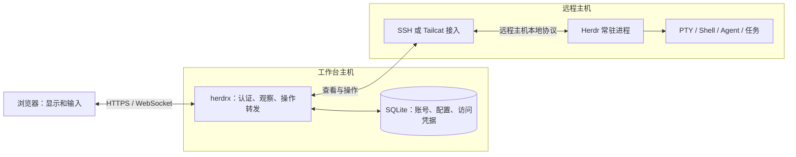

# Web 工作台最终实施方案：远程任务独立运行与访问管理

状态：代码实现与本地验收已完成；首次 GitHub 发布和 arm64 原生运行待流水线执行。具体证据及限制见 [验收报告](../auth-admin-validation-2026-09-06.md)。

目标：让 herdrx 成为可随时离线、恢复或更换的远程 Web 终端工作台，远程 Herdr 和任务独立存活；修复已复现的 5 个认证问题，并交付可实际使用的管理员页面。保留现有单实例、SQLite、Argon2id 和服务端 Cookie 会话架构，既有用户、密码、主机、凭据和绑定数据继续使用。

方案有两个同时成立的完成条件：**撤销后不能继续经工作台访问；断开工作台后远程任务继续运行。**

## 产品前提：远程 Herdr 的运行不依赖工作台主机

| 术语 | 所在位置与职责 |
|---|---|
| 浏览器 | 用户电脑或手机上的客户端，显示工作台并发送操作 |
| 工作台主机 | 部署 herdrx 网站、API、SQLite 和连接适配器的机器，负责认证、主机配置及访问转发 |
| 远程主机 | 用户接入的其他机器，独立运行 Herdr、PTY、Shell、Agent 及任务 |

Herdr 服务端运行于远程主机，herdrx Web 服务端运行于工作台主机。后文避免用“服务器”混指两者；网站 Docker 镜像的部署目标是工作台主机。



图中的跨主机连线承载访问，不承担远程任务的保活。SQLite 不保存远程任务进程或接管远程 PTY；远程状态以 Herdr 为准，工作台的缓存可丢弃并在重连后重新读取。

远程主机上的 Herdr 独立管理 workspace、tab、pane、PTY 及运行中的 Shell/Agent/任务。Web 工作台提供查看和按需交互的入口，不拥有这些资源的生命周期。**即使工作台主机整台机器关机、宕机或被删除，远程主机上的 Herdr 和任务也必须继续运行。**

远程任务存活不能依赖工作台侧进程、持久在线连接或心跳续租。工作台离线会失去经由它的查看、控制和通知能力，用户仍可在远程主机上直接使用 Herdr。恢复访问时重新连接已有会话；若工作台数据也已丢失，需恢复账号、连接配置和必要凭据，不能因此重新创建或重启远程任务。

本文的“会话撤销”“断开终端”“清理输出流”均指撤销 **Web 访问权限**、关闭 **Web 观察连接**。SQLite sessions 是 Web 登录记录，与 Herdr 会话没有销毁关系。

| 场景 | Web 侧行为 | Herdr 与运行中任务 |
|---|---|---|
| 关闭/刷新网页、切换主机、浏览器休眠或断网 | 释放或失去当前观察连接 | 继续运行 |
| 退出登录、Web 会话过期、管理员禁用账号或撤销登录 | 终止相应 Web 访问，要求重新认证 | 继续运行，不能发送 Ctrl+C、exit 或关闭 pane |
| Web 服务重启、升级或崩溃 | 观察连接中断；服务恢复后重新连接 | 生命周期保持独立，不随网站服务退出 |
| 工作台主机整机关机、宕机、被删除或完全失联 | 经由该工作台的访问与通知不可用 | 远程 Herdr、PTY 和任务继续运行，不依赖工作台存在 |
| 重新打开网页或从另一设备访问 | 在有效授权下读取现有拓扑，重新订阅输出 | 连接原有 pane，查看当前状态和 Herdr 保留的历史 |
| 用户明确关闭 Herdr pane/tab/workspace | 确认影响后调用对应关闭 API | 按该操作的语义结束相应资源与任务 |

关闭一个浏览器连接不能关闭其他浏览器的有效观察连接。没有任何浏览器在线时，任务仍须推进；不能依靠后台保留一条 WebSocket 才让任务存活。浏览器卸载、认证失效、连接清理和网站停止路径均不得隐式调用 `pane.close`、`tab.close`、`workspace.close`，也不得发送终止任务的信号或输入。

断开时可以终止由网站启动的 `herdr terminal session observe` 客户端进程、释放 SSH 通道和相关缓冲；这些是观察资源，不能与远程 Herdr 服务端、PTY 及其子进程混为一谈。底层进程归属和清理边界需在本机、SSH、Tailcat 三种接入方式上分别验收；整机故障隔离必须使用不同机器的工作台与远程 Herdr 验收。现有本机接入共享所在机器的故障边界，仅可用于该模式的连接清理验证。

Web 后台使用“登录会话”“注销登录”“断开访问”等文案，避免把“注销全部登录”显示为“停止全部终端”。关闭浏览器标签页与工作台内关闭 Herdr Tab 是不同操作，后者必须明确提示其中的进程会结束。

### 连接层的实现边界

| 资源 | 归属 | 结束条件 |
|---|---|---|
| Web 登录会话 | 工作台 SQLite | 用户注销、到期、管理员撤销或禁用 |
| Web 观察连接 | 当前浏览器访问 | 页面离开、连接失败、登录失效或权限撤销 |
| SSH/Tailcat 传输与观察客户端 | 工作台连接层；观察客户端可位于远程主机 | 引用释放、空闲回收、连接故障或显式访问撤销 |
| Herdr 会话、PTY 与任务 | 远程主机 | 任务自身结束、用户明确关闭目标资源，或远程主机自身的运行事件 |

- 为共享传输记录消费者引用。关闭一个观察连接只释放自己的观察流；其他有效浏览器仍使用的连接不能被关闭。没有消费者时可以关闭空闲传输，远程任务仍继续运行。
- 远程 Herdr 必须由远程主机自身启动并独立运行。接入只连接现有服务；服务未运行时给出在远程主机启动 Herdr 的指引。不能把远程 Herdr 或 pane 的 PTY 作为随 Web 请求取消而销毁的子进程，也不能将其保活绑定到接入代理的进程组。
- 观察流卡顿、浏览器不消费输出或连接失效时，只丢弃/重建该观察订阅；不能暂停远程 PTY、阻塞任务输出直到浏览器恢复。高输出量任务也要验收这一点。
- 重新连接先验证 Web 身份和主机归属，再读取原拓扑、恢复观察。只恢复 Herdr 当前状态及其实际保留的历史，不承诺工作台离线期间存在额外的完整录像。
- 明确区分“注销 Web 登录”和“解绑远程接入”。注销、禁用不删除远程绑定或主机凭据；只有显式解绑才变更对应接入授权，解绑同样不能结束 Herdr 任务。
- 所有释放接口、取消 context、SSH channel 关闭和进程信号的对象必须可追踪，避免将“杀掉观察客户端”错误实现为终止整个远程进程组。

## 一、交付范围与顺序

| 批次 | 交付内容 | 完成标准 |
|---|---|---|
| A：远程运行与连接边界 | 确认现有 Herdr 独立运行；收敛观察流/共享传输清理、重连与命名；加入隔离验收 | 断开工作台及工作台整机离线时，远程任务继续；其他有效浏览器不被误断 |
| B：认证与撤销 | 统一会话管理、Web 访问撤销、来源校验、注册资源保护、可信代理限流、前端失效处理 | 5 个问题的回归测试全部通过；撤销后访问被拒绝且任务继续 |
| C：管理员功能 | 用户列表与禁用/启用、登录会话列表与撤销、邀请列表与撤销、审计查询 | 管理操作的权限、事务、撤权及页面反馈完整；禁用同时停止该用户后台观察和推送 |
| D：升级与发布验收 | 存量数据库迁移、双架构镜像验证、文档和发布检查 | 存量账号可登录，已撤销授权不恢复，远程任务独立性与候选镜像均通过验收 |

A 先确定资源归属和断开语义，B 统一实现认证撤销，C 复用该能力提供管理操作，D 验证升级后的整体行为。可以分批审查，本方案的完成条件包括四个批次。

本轮管理操作保留 `admin`、`user` 两种角色，不提供账号硬删除或角色变更；禁用账号保留其主机和凭据。密码找回、MFA、SSO 属于后续独立功能，不作为这 5 个问题的修复依赖。

## 二、会话有效性与终端撤权

### 2.1 统一会话服务

在 `internal/httpapi` 增加会话生命周期组件，由 HTTP 鉴权、登录签发、注销、管理员撤销和工作台共同调用。SQLite 保存有效会话，内存维护 `user_id → session_id → 活跃连接`，注册连接时返回可注销的句柄。

统一规则：会话必须存在、未到期，且用户未禁用。数据库故障返回明确的服务错误并阻止新操作，不能当成有效会话放行，也不能当成“已经注销成功”。

| 动作 | 持久化操作 | 活跃连接处理 |
|---|---|---|
| 退出当前登录 | 删除当前 session | 关闭该 session 的全部连接，覆盖同 Cookie 的多个标签页 |
| 撤销单个会话 | 按用户和 session 删除 | 关闭该 session 的连接 |
| 撤销用户全部会话 | 删除用户全部 sessions | 关闭用户全部连接 |
| 禁用用户 | 同一事务设置 disabled、删除全部 sessions 及该用户推送订阅 | 阻止新连接、新指令，关闭用户全部 Web 连接，取消其后台观察和未发送推送 |
| 重新启用 | 只更新 disabled | 必须重新登录，旧 token 和连接不能恢复 |
| 会话到期 | 鉴权拒绝，到期记录可异步清理 | 到期定时器立即使连接失效并关闭 |

### 2.2 并发与操作边界

- 连接注册与撤销协调，注册后复查数据库有效性，堵住“HTTP 已鉴权、管理员已撤销、随后才注册连接”的窗口。
- 以用户/会话为单位使用短临界区，串行化本地的连接注册、撤销状态切换和操作准入。锁内不做 SSH、Herdr 调用、网络写入或等待 WebSocket 关闭握手。
- 注销或禁用成功响应前，先阻止相关会话接受新的操作，再取消连接；关闭握手有短超时，必要时强制关闭。
- 文本 RPC、二进制终端输入、resize、terminal.open 等所有能触达主机的消息都经过操作准入检查，不能只给 `pane.send_text` 加判断。准入先检查内存撤销状态，再通过轻量 SQLite 查询确认 session 存在、有效且用户未禁用，避免依赖过时的握手快照；该查询不读取密码哈希。
- 已准入并已发送到 Herdr 的命令可能已经生效，撤销不能撤回这些操作。验收边界是：撤销生效后不再准入新操作，未发送的排队操作取消，终端输入不自动重放。
- 每条连接绑定原会话到期时间，使用定时器；增加数据库有效性复核，默认周期 5 秒，用于空闲连接及持续输出连接。绕过正常入口修改数据后，新指令仍由准入查询立即拦截；纯输出连接最多等待一次复核周期。这个周期不是正常注销或禁用的等待时间。
- 连接退出要取消快照轮询、观察流读取与 credit 等待并释放本连接资源；Herdr 服务端、pane 的 PTY 和任务继续运行，也不能误关其他有效用户的连接。
- 登录验密完成后，签发 session 的事务再次检查用户状态，并与禁用操作协调，防止禁用期间签发可用的新会话。
- Web Push 是用户主动授权的后台订阅，关闭网页不取消订阅；禁用账号则取消其后台观察和推送。轮询前与发送前都复查用户有效性，禁用提交后不再准入新采集/发送。已交给外部推送服务的消息无法撤回。重新启用后须重新登录并明确开启通知。

WebSocket 使用应用关闭码 `4401` 表示登录失效；`4404` 等主机故障码保持独立。前端收到 `4401` 停止自动重连并进入认证失效流程。

WebSocket 会话到期、退出时断开连接及连接映射的设计依据见 [OWASP WebSocket Security](https://cheatsheetseries.owasp.org/cheatsheets/WebSocket_Security_Cheat_Sheet.html#session-management)。上述并发边界是本项目的实施要求。

## 三、注册、登录与初始化入口

### 3.1 注册处理顺序

```text
来源与请求大小校验
  → 注册模式检查
  → 客户端限流
  → JSON 与字段校验
  → 邀请码低成本预检查
  → 获取密码计算配额
  → Argon2id
  → 事务内复查邀请码、创建用户并消费邀请码
  → 签发会话
```

预检查只检查邀请码哈希对应记录是否存在、未使用、未撤销、未过期；不预先消费邀请码。最终事务仍必须检查这些条件，确保并发注册最多成功一次。哈希计算不得放在 SQLite 写事务内。

新增明确的存储错误分类：无效邀请、邮箱已存在、存储失败。只有有效邀请通过后才允许提示邮箱已存在；此时事务回滚，邀请码仍可使用。数据库错误返回 5xx，不能伪装成邀请码错误。

### 3.2 资源保护

- 登录验密、注册哈希和管理员初始化共享密码计算并发预算，建议初始总并发为 2，注册最多占用 1 个名额。满额快速拒绝并返回重试提示，不建立无界等待队列。
- 保留现有 Argon2id 强度。当前每次计算使用约 64 MiB，两个并发的算法工作内存约为 128 MiB，这不是进程内存上限；验密函数允许的更高参数和 Go 运行时开销也必须计入容量验证。
- 使用可配置的 `HERDRX_AUTH_HASH_CONCURRENCY`，默认 2；注册预算受总预算约束。实际默认值在目标规格的隔离测试中确认。
- 建议注册和初始化各限制为每客户端每分钟 5 次；初始化先校验 bootstrap token，再做密码计算。
- 用 `http.MaxBytesReader` 明确执行现有 1 MiB 请求体上限并返回 413，限制超大字段，保留既有密码登录兼容性；本轮不借修复改变已有账号的密码规则。
- 限流状态定期过期清理，并限制条目总数。达到总数上限时对新来源短暂拒绝，不能无限扩张内存。

以上数值是建议起点，验收必须检查并发上限及恢复行为，而非只比较一次请求耗时。保留密码哈希强度并控制在线资源消耗的取舍参考 [OWASP Password Storage](https://cheatsheetseries.owasp.org/cheatsheets/Password_Storage_Cheat_Sheet.html#using-work-factors)。

### 3.3 可信代理与登录限流

新增 `HERDRX_TRUSTED_PROXIES`，接受明确的 IP/CIDR 列表，默认空；只信任直连来源落在该列表中的代理。

- 直连模式：使用 `RemoteAddr`，忽略用户自带的转发头。
- 可信代理模式：从可信直连代理开始，沿 `X-Forwarded-For` 从右向左剥离可信跳点，以首个不可信地址作为客户端。限制链长度、校验 IPv4/IPv6，异常时保守回退，不能使用攻击者可控的最左地址。
- 限流、会话设备信息和审计统一使用同一解析函数。
- 登录采用“客户端 IP 总量”和“客户端 IP + 规范化邮箱”两个桶，建议分别为 60 次/分钟和 10 次/分钟。成功只重置相应账号的失败桶，不清空整个 IP 的总量限制。
- 不因某个来源连续失败就永久锁定全局账号；跨来源攻击由密码并发预算及账号异常记录补充约束，避免制造另一个可被恶意触发的账号封锁入口。

Compose 的 Caddy 模式要提供可复现的信任配置：专用代理网络、明确的代理地址或网段，并支持覆盖以避免地址冲突。应用的后端端口仅绑定回环地址或由 TLS 叠加配置移除对外映射。直连模式继续使用自己的配置。

不能笼统信任所有私网地址，也不能只加一个环境变量后依赖用户猜 Docker 网段。部署验收必须经过真实 Caddy，包含伪造转发头和两个独立客户端的测试。

Caddy 默认生成转发头并忽略不可信传入值的行为见 [Caddy reverse_proxy 文档](https://caddyserver.com/docs/caddyfile/directives/reverse_proxy#defaults)。Caddy 前方另有代理时，需要逐跳明确信任边界。

## 四、来源校验与登录 CSRF

增加统一的写请求来源中间件，覆盖登录、注册、初始化、注销和已认证管理操作；WebSocket 握手使用同一套来源配置。

1. 目标来源由 `HERDRX_PUBLIC_URL` 和显式配置的 `HERDRX_ALLOWED_ORIGINS` 确定，按协议、主机、端口精确匹配。配置启动时校验，不接受通配符或根据任意转发头动态放行。
2. 拒绝 `Sec-Fetch-Site: cross-site`。仍然进行 Origin 校验，不能把 `same-site` 自动视为可信。
3. 有 Origin 时精确匹配；没有时验证 Referer 的 origin；两者均缺失或值为 `null` 时拒绝浏览器会话写接口。自动化测试及运维请求显式携带合法 Origin。
4. 登录、注册和初始化只接受 `application/json`，允许合法 charset 参数，其他媒体类型返回 415；来源不符返回 403。
5. 已登录写请求继续验证会话绑定的 CSRF token。图片上传仍使用 multipart，不能把全局 JSON 限制错误地套到上传接口。
6. WebSocket 在升级之前验证来源，不把 token 放进 URL。维持当前同源前端访问方式，不开放宽泛的带凭据 CORS。

对应更新 `scripts/smoke-image.py`、HTTP 测试及开发代理配置，验证本机开发、直接部署和 Caddy HTTPS 均能正常登录。来源配置错误应给出可诊断的错误码，页面显示“访问地址未被实例允许，请使用配置的站点地址”。

这一组合针对普通表单可构造 JSON 的问题，同时保留已有会话 CSRF 保护，参考 [OWASP CSRF Prevention](https://cheatsheetseries.owasp.org/cheatsheets/Cross-Site_Request_Forgery_Prevention_Cheat_Sheet.html#disallowing-simple-content-types)。

## 五、前端认证状态与注销

### 5.1 统一失效处理

API 层提供认证失效通知，由 AuthProvider 处理。受保护接口收到 `401 unauthenticated` 后，清除 user 和内存 CSRF、关闭工作台连接及重连定时器、清理账号相关页面状态，显示“登录已失效，请重新登录”。

不能把登录密码错误产生的 401 作为全局退出事件；403 权限不足、网络异常和 5xx 也分别处理。为请求绑定本地认证代次，旧会话请求迟到的 401 不得清除刚完成的新登录。

WebSocket 在升级前被拒绝时，浏览器不一定能读到 HTTP 401。遇到握手失败/异常关闭，先通过 `/api/me` 确认认证状态，再决定回到登录页还是按网络故障重连。普通网络中断保留当前重连能力。

使用 BroadcastChannel 在标签页间发送“需要重新验证认证”的信号，接收方重新读取 `/api/me` 并清理失效连接；不广播密码、Cookie 或 CSRF token，不向 localStorage 保存认证凭据。

### 5.2 注销接口幂等

- 会话有效：验证来源及 CSRF，持久化撤销、阻止新操作、取消连接，最后清 Cookie 并返回成功。
- 会话已不存在或已过期：验证来源后清 Cookie，返回成功；兼容旧服务返回 401 时前端也完成本地退出。
- 数据库或网络失败：显示“退出未完成，请重试”，不能假装服务端已经撤销。后端不得忽略 DeleteSession 的错误。
- 幂等注销需要可选会话解析，不能继续依赖一律在路由入口返回 401 的强制鉴权；有效会话仍必须经过 CSRF 校验。

扩展现有 `GET /api/bootstrap/status` 返回 `registration: invite|closed`。注册关闭时隐藏创建账号入口；注册密码字段使用 `new-password`，异步操作均提供 pending、错误和重试反馈。

## 六、管理员页面与接口

新增 `/admin` 页面，包含用户、邀请、审计三个页签；用户详情内查看会话。入口和路由仅向管理员显示，后端仍独立强制鉴权、角色和 CSRF，不能依赖前端隐藏按钮。

| 接口 | 行为与主要约束 |
|---|---|
| `GET /api/admin/users` | 分页返回用户、角色、禁用状态、有效会话数，不返回密码哈希 |
| `PATCH /api/admin/users/{id}` | 仅接受 disabled 字段；禁用同事务删除登录会话与推送订阅，禁止自禁用及禁用最后一位可用管理员 |
| `GET /api/admin/users/{id}/sessions` | 展示 session ID、UA、来源 IP、创建/到期时间；不返回 token、token hash 或 CSRF |
| `DELETE /api/admin/users/{id}/sessions/{sessionID}` | 校验会话确实归属该用户，调用统一撤销服务，重复撤销幂等 |
| `DELETE /api/admin/users/{id}/sessions` | 注销该用户的全部现有会话，包含管理者自己的会话时明确提示并退出 |
| `GET /api/admin/invites` | 扩展为分页，区分可用、已使用、已过期、已撤销 |
| `POST /api/admin/invites` | 注册为 invite 模式时允许创建；明文只在创建成功时显示一次，保持一次性和默认 7 天有效 |
| `DELETE /api/admin/invites/{id}` | 未使用邀请标记撤销，重复撤销幂等；已使用返回明确冲突，不能连带撤销已注册账号 |
| `GET /api/admin/audit` | 按操作人、动作、时间分页查询，使用参数化查询和有界分页 |

角色变更和账户硬删除不在上述接口内，拒绝未知字段。最后一位管理员保护必须和状态修改在同一写事务内执行，覆盖两个管理员并发互相禁用的情况。

禁用和全部注销的弹窗明确影响对象及连接数量；按钮等待请求成功后更新页面。邀请码列表不提供找回原码，创建响应丢失可撤销该条后重新生成。注册关闭时前后端同时禁止新建邀请，既有邀请可查看和撤销。

管理员变更及对应审计记录同事务提交；关键审计失败则操作失败。记录操作人、目标、动作、结果、请求 ID、客户端地址与时间，不记录终端内容、密码、会话 token、邀请码明文或 SSH 私钥。

## 七、存储与文件修改范围

保留现有用户和会话表。邀请表增加可空的 `revoked_at`、`revoked_by`、`used_at`；旧邀请按原有 used_by/expires_at 推导状态，历史使用时间未知时保持空值，不编造时间。旧数据中没有撤销标记的邀请继续按原规则验证。

现有 sessions 已有 user_agent、remote_ip、created_at、expires_at，可直接用于管理页面；“最后活跃时间”目前没有可靠数据，不展示为在线状态。有效会话表示未过期的登录凭据，不等同于浏览器在线。

按实际查询增加邀请和审计索引。迁移在事务内幂等执行，失败终止启动。WAL 使用 synchronous=FULL，以保证成功提交的授权撤销与配对记录在工作台主机掉电后保留。结构变更有明确 schema 版本，发行文档注明兼容版本，不能静默忽略迁移失败。

| 文件或模块 | 主要改动 |
|---|---|
| `internal/httpapi/auth.go`、`server.go`、新增会话组件 | 会话签发/鉴权/撤销，入口保护，错误分类 |
| `internal/httpapi/workbench.go` | 连接注册、操作准入、到期和撤销关闭 |
| `internal/hostruntime/factory.go`、`internal/herdr`、必要的接入适配 | 共享传输引用与观察客户端清理，保证不接管远程 Herdr/PTY 的生命周期 |
| `internal/httpapi/push.go`、`internal/store/push.go` | 禁用用户的后台采集和发送准入，订阅撤销和取消处理 |
| `internal/httpapi/context.go`、新增限流及来源中间件 | 可信客户端地址、有界限流、精确来源校验 |
| `internal/store/users.go`、`invites.go`、迁移和审计查询 | 原子禁用/撤销、邀请码预检查、管理查询 |
| `internal/httpapi/admin.go` | 管理员 API、最后管理员保护、审计事务 |
| `web/src/lib/api.ts`、`auth.tsx`、`lib/workbench.ts` | 认证失效、跨页签通知、注销错误、WS 重连分类 |
| `web/src/pages/AuthPage.tsx`、`HostsPage.tsx`、新增管理页 | 注册模式、管理入口、列表和操作反馈 |
| `internal/config`、`deploy`、开发代理及 smoke 脚本 | 来源/代理/计算配额配置，以及对应运行方式 |
| 安装、运维、恢复、发布文档及 README | 配置说明、实际已实现功能和升级边界 |

初始化入口一并做小范围一致性修复：bootstrap token 的并发访问同步；数据库仍保证只创建首位管理员；成功后清理 token 文件；启动日志只提示文件位置，不输出 token 原文。随机数生成、session 持久化、关键审计失败均显式处理。此项是实施时的静态加固，不混同于已复现的 5 个问题。

## 八、验收清单

### 必须转为正式回归测试

- [x] 注销、会话到期、禁用后三种情况下，旧 WS 均不能继续操作，已打开的 Web 观察流关闭；Herdr、pane 与任务继续运行。
- [x] 同 session 多标签全部失效；撤销另一用户或另一 session 不误伤无关连接。
- [x] 连接注册与注销并发、登录签发与禁用并发不留下有效旧授权；重启和重新启用不恢复已撤销 token。
- [x] 覆盖文本 RPC、二进制输入、resize、terminal.open，以及空闲连接的到期；通过 fake Herdr 断言未转发新操作。
- [x] 隔离数据库中直接标记会话过期或用户禁用后，新指令立即拒绝；输入频繁时检查新增 SQLite 查询的延迟，无全局锁串行等待远端响应。
- [x] 无效/过期/使用过/撤销的邀请码不调用密码哈希器；多个请求争抢同一码只创建一个用户。
- [x] 正确邀请码遇到重复邮箱时不被消费；数据库故障不被错误标成邀请码错误。
- [x] 计算配额在成功、失败和请求取消后均释放；隔离并发测试符合上限并能恢复正常登录。
- [x] 两个真实代理客户端限流隔离，伪造 XFF 不改变不可信来源身份；覆盖 IPv6、多代理和畸形头。
- [x] 跨站 text/plain 表单不能设置登录 Cookie；合法 JSON 同源请求可用，跨站 JSON、null/缺失来源符合既定拒绝策略。
- [x] 受保护接口 401 清除认证；密码错误、403、5xx 不误退出；旧请求迟到的 401 不覆盖新登录。
- [x] WS 4401 和握手阶段认证失败停止重连；网络中断保持正常重连；注销失败明确反馈。
- [x] 管理员、普通用户、匿名用户的 API 权限与 CSRF 检查正确，列表分页和字段输出没有认证秘密。
- [x] 自禁用、最后管理员保护、并发禁用、邀请码撤销与注册竞争、事务审计失败均覆盖。
- [x] 已启用推送的账号被禁用后，后台采集和未发送通知停止；任务继续运行。重新启用不复活旧登录或旧推送订阅。

### 集成与发布

- [x] 在隔离的 Herdr 会话中运行持续推进并写入计数的任务，记录服务端、pane/任务 PID 及资源 ID；分别关闭网页、注销、模拟断网、禁用 Web 用户和重启隔离网站实例，确认任务在无浏览器期间仍推进，PID 和资源 ID 未被替换。
- [x] 在独立的测试工作台主机和远程主机上，通过 SSH、Tailcat 分别接入；关停测试工作台整机并保持离线，从远程主机独立检查 Herdr、PTY、任务 PID 及计数持续推进。恢复测试工作台并重连原会话，证明任务存活不依赖 Web 进程、工作台主机或接入隧道；仅重启网站容器不足以完成此项验收。
- [x] 分别测试正常停止与突然失联，防止只验证依赖优雅退出的清理路径。对持续高输出量任务断开所有观察者，确认任务没有因浏览器背压、观察客户端或工作台消失而暂停。
- [x] 重连后看到原有 workspace/tab/pane、任务的当前输出及 Herdr 保留的历史；未重新创建任务、重放输入或重复执行初始化命令。本机、SSH、Tailcat 分别验收，不能只用 fake Herdr 证明任务存活。
- [x] 两个独立浏览器同时观察同一 pane，关闭或撤销其中一个 Web 登录时，另一个有效登录仍可观察，任务不中断。显式关闭 Herdr pane/tab/workspace 则按提示结束目标资源，不能把该功能改成单纯隐藏页面。
- [x] 使用真实浏览器完成初始化 → 邀请注册 → 登录 → 打开终端 → 管理员禁用 → 页面退出 → 启用后重新登录。
- [x] 浏览器跨站表单实测被拒绝；多标签、手机窄屏管理页和注销交互正常。
- [x] 使用现有数据库结构的隔离副本验证迁移，已有账号/密码/主机/凭据/绑定关系不变；迁移重复启动成功。
- [x] `go vet`、Go 普通测试及 race、前端 typecheck/lint/Vitest 通过，并运行新增浏览器用例。
- [x] 重建前端 embed 资源；构建双架构候选镜像；amd64 通过持久化重建冒烟和真实 Caddy 集成测试。
- [ ] 首次推送后，由 GitHub Actions 完成 amd64/arm64 原生容器验收与发布；本机不具备原生 arm64 环境。
- [x] 继续使用 GitHub Actions → ZOT → 工作台主机拉取的发布流程，所有持久化目录仍为 bind mount；网站发布不部署、升级或重启远程主机上的 Herdr。

发布验收同时检查两组证据：访问撤销后没有新的远程指令/观察数据通过；远程 Herdr/任务的 PID、资源 ID 和独立计数继续保持或推进。任何一组缺失都不能标记完成。整机故障测试只使用独立测试主机，不操作用户正在使用的工作台、远程 pane 或任务。

升级前用现有备份方式保存数据库和主密钥。升级会断开当前浏览器连接，未撤销且仍有效的会话可重连。数据库备份恢复可能恢复旧 sessions，因此恢复后必须清空会话并重新登录；新增邀请撤销功能后，旧二进制可能忽略撤销字段，不允许直接降回不认识该状态的版本。优先修复后前进，必要回退使用备份并关闭注册、清理会话及未使用邀请后再对外服务。

业务实现及本地验收已完成。现有体验实例未切换，源代码尚未提交/推送；首次远端原生双架构验收和发布以 Actions 结果为准。
