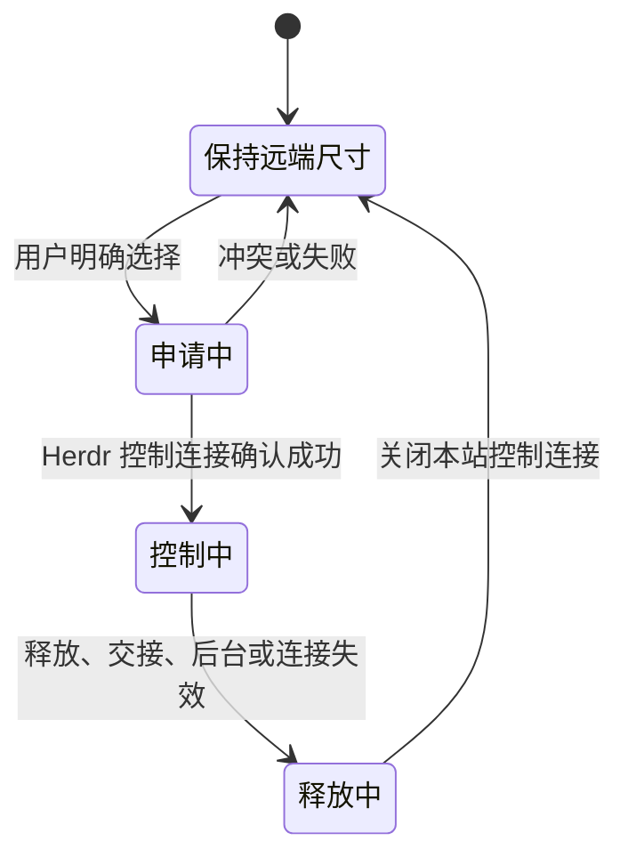

# 多端终端显示与 Herdr 兼容性优化方案

日期：2026-09-20。状态：**A1/A2/B1/B2/C1 已实现，正在完成集成与发布验收；C2/D 已完成隔离实验，产品保持禁用**。最终结果见[验证记录](../terminal-sizing-validation-2026-09-20.md)。

依据：[Herdr 源码与隔离实验调研](../herdr-remote-sizing-research-2026-09-20.md)。当前代码基线为 `c665c8a`，上游分析基线为 Herdr v0.9.1。

## 1. 目标与实施选择

本轮优先让电脑、手机和已安装 PWA 的尺寸行为可预测，并把 Herdr 版本兼容性纳入日常维护。

实施中保留 CLI control 与独立输入路径，观察采用窄范围的原生 ObserveTerminal 适配器。真实整链回归证实 CLI observe 的画布固定不跟随 PTY，故新增只读画布同步；无法读取源几何时保留 CLI 观察降级并禁用任务尺寸控制。详情见[验证记录](../terminal-sizing-validation-2026-09-20.md)。

本轮不直接迁移整个工作台到 ClientShell，不将原生客户端的“获得焦点即控制尺寸”作为网页默认行为。调研已证明：新原生客户端启动时也会主动获得焦点，从而改变共享任务尺寸。照搬会重新引入手机打开页面影响电脑任务的问题。

三个明确结果：

1. 打开或刷新任意设备，只连接原有任务并显示当前画面；需要重排任务时，由用户明确选择。
2. 用户能区分本地字号适应与远端任务尺寸调整，能看见、释放和交接本站的尺寸控制权。
3. 接入前能知道实际 Herdr 能力；上游版本变化由固定版本测试发现，不依赖用户报告滚动或终端连接故障。

## 2. 固定边界

- 一个 pane 的任务只有一份真实 PTY 网格。不能承诺电脑和手机同时让同一任务按各自宽度独立重排。
- “保持远端尺寸”仍可输入；**尺寸控制权不等于输入独占权**。保持目前多入口交互方式，不以尺寸优化为由引入首键抢锁或自动重放输入。
- 尺寸控制仅管理 Web 访问连接；不持久化到数据库，不作为远程任务保活条件。
- 浏览器关闭、后台、认证失效、网站重启或工作台离线，只释放访问连接。任何路径都不得调用关闭 pane/tab/workspace 或停止 Herdr 的 API。
- 每条尺寸操作继续执行现有 owner 与认证准入检查；控制状态不向无权访问该主机的账号公开。
- 网站不安装、升级、重启远程 Herdr；不自动执行 live handoff。`herdrx update` 继续只更新本项目 CLI。
- 默认 HTTP 与现有部署方式保持适用；PWA 按安全上下文启用，不把域名或 HTTPS 改造成网站部署前置条件。

本方案以当前实现为基准。历史 v0.4 草案里的输入独占租约、首键缓存和 90 秒会话恢复，不随本方案重新引入。

## 3. 用户界面与多端规则

### 3.1 将两个概念分开

终端工具中分开呈现：

| 控制项 | 选项或操作 | 对远端任务的影响 |
|---|---|---|
| 本地显示 | 自动适应、完整显示、固定字号 | 只调整本地字体或可见区域 |
| 任务尺寸 | 保持远端尺寸、使用此窗口尺寸 | 后者取得尺寸控制后才调整 PTY |
| 尺寸状态 | 当前 133×49；由此窗口控制；本站其他窗口控制 | 展示实际状态，不根据前端偏好推断成功 |

保留现有桌面 `auto`、手机 `fixed` 默认值。自动适应沿用 10px 可读字号下限；完整显示允许用户主动选择更小字号。手机继续单 pane 浏览，并保留可见的横向/纵向查看入口与“完整显示”快捷操作。

点击“使用此窗口尺寸”时，在同一控件内说明：“会让此终端按当前窗口重新排版，其他窗口也会看到变化。”这是明确的用户操作，无需每次调整窗口重复确认。

取得尺寸控制后，以**用户选择的字号**计算目标行列数，不使用自动 fit 后的字号反向计算远端网格，避免“网格变化→缩字号→网格再变化”的循环。释放后恢复此前的本地显示偏好。

### 3.2 不把临时控制保存成偏好

| 行为 | 规则 |
|---|---|
| 新开页面、刷新、重新登录、重新打开 PWA | 默认保持远端尺寸 |
| 点击终端、开始输入、窗口获得焦点 | 不因此取得尺寸控制 |
| 本地观察模式下旋转手机、弹出键盘、拖动侧栏 | 仅改变本地显示 |
| 此窗口已控制尺寸，旋转或弹出键盘 | 按稳定后的可用区域计算新网格 |
| 切主机、切 tab、手机切出当前 pane、进入聊天视图 | 释放相应尺寸控制；回来后先观察 |
| 多分屏桌面 tab | 可见 pane 各自独立申请和持有控制；只切键盘焦点不释放；本轮不新增“整 tab 接管” |
| 页面进入后台、失去网络、连接失效 | 释放或到期释放；恢复后先观察 |
| 用户选择固定字号/完整显示但仍在控制状态 | 提供清楚的释放入口，避免用户误认为只变了本地字号 |

此处选择以 **terminal** 为第一期控制粒度，与当前 direct control 的实际互斥单位一致；不能在 Web 侧假装已经实现原生 ClientShell 的按 tab 仲裁。

### 3.3 冲突与交接

- 同一终端已由本站其他窗口控制：显示“另一个窗口正在控制尺寸”，提供“保持远端尺寸”和“转到此窗口控制”。后者用现有自绘确认组件说明旧窗口会恢复观察。
- 本站能确认旧控制者时，交接只关闭本站持有的旧 controller，再以 `takeover=false` 打开新 controller。
- 如果 Herdr 拒绝且本站没有对应控制记录，显示“该终端已有其他尺寸控制连接，请先在对应客户端释放”。不猜测外部客户端身份，不调用 `takeover=true` 驱逐未知连接。
- 原生 TUI 并不一定表现为 direct-control 冲突。即使取得控制成功，也只说明本窗口可以调整共享 PTY，不能显示“其他客户端不受影响”。

## 4. 第一阶段：版本探测与回归基线

### 4.1 连接能力报告

在主机连接建立后，经现有安全 transport 读取：

| 数据 | 来源与用途 |
|---|---|
| 安装的 Herdr CLI 版本、私有协议 | 二进制版本与本地 schema；用于判断 CLI 启动 observe/control 的兼容性 |
| 实际 daemon 版本、协议、可选 capabilities | 目标命名会话的 `ping` / `session.snapshot`；它才是当前任务服务的事实 |
| herdrx 受控端能力 | Tailcat 的已有版本信息及只读能力探测，区分与 Herdr 的版本问题 |
| 连接代次、探测时间、测试覆盖标识 | 防止重连或后台升级后仍使用旧能力缓存 |

`api schema` 属于安装的 CLI，不能直接认作后台 daemon 的能力声明。旧 daemon 缺少可选字段时应按未声明处理，不伪造支持。产品版本不同但协议相容时不直接拒绝；私有协议不一致时单独禁用依赖它的观察/控制功能，保留仍可安全使用的 JSON 读取路径。

由适配层生成按功能的结果：快照、终端观察、文本输入、远端 resize、保尺寸滚轮、历史读取。每项包含可用性、证据与原因，不用单个“版本≥0.8.0”代替能力判断。探测不创建 pane、不发送输入、不触发 resize，也不执行写操作测试。

能力缓存绑定到连接代次。重连必须重新探测；轮询发现 daemon 版本/协议变化时失效缓存并使旧尺寸控制失效。首次调用发生明确的 unsupported 错误时仅关闭相关能力；网络超时不能永久标为“不支持”。

主机详情展示版本与功能状态，主要界面只在相关功能受限时给出动作提示。区分：已验证、能力可用但尚未纳入版本验证、部分功能不可用、连接不可用。不因为未见过产品版本就禁用已验证协议，也不尝试猜测未知私有协议。

### 4.2 固定版本测试

- 0.8.2 / 协议 20：既有兼容基线，保留回归。
- 0.9.0 / 协议 22：版本过渡回归。
- 0.9.1 / 协议 22：本轮主要目标；已有本地核心测试通过，继续补全 transport 和设备覆盖。
- Release 二进制使用固定 tag、固定 SHA-256 下载并缓存。必要 job 中缺失二进制或真实测试被 skip 必须失败。
- Linux amd64 的三版本核心回归作为门禁；0.9.1 再覆盖 Linux arm64、macOS 两架构的适用功能。macOS 基础 SSH 的现有功能限制仍要如实标注。
- 单独加入 CLI 与 daemon 不同版本、未知协议、缺少可选方法的测试。此类测试不更改或重启用户实例。

维护者每次准备发布时检查上游正式 Release，更新候选测试版本后再更新支持矩阵。第一期无需给每台远程主机增加联网查最新版本的功能。

## 5. 第二阶段：尺寸控制与交接

### 5.1 服务端记录与状态机

在工作台进程中加入共享的尺寸控制管理器；不能把控制状态仅存在某一个 WebSocket 的局部变量中。

索引至少包含授权 owner、主机接入记录、Herdr 命名会话/连接代次以及稳定 terminal ID。pane ID 用于界面定位，不能跨 daemon 重建复用旧授权。同一远端经多个接入别名出现时，只有在能可靠识别为同一个 runtime 后才合并记录；否则仍以 Herdr 的 direct-control 互斥作为最终约束，不宣称本站目录全局完备。

记录包含服务端生成的持有者 ID、控制代次、所属访问会话、到期时间、最新请求序号与目标尺寸。浏览器提供的设备名/instance ID 仅用于展示和定位，不能作为授权凭证。

不能以“子进程已启动”作为取得控制成功；当前 `OpenTerminal` 返回成功后，Herdr 仍可能在输出/退出信息中拒绝 attach。只有收到可验证的初始输出、且没有拒绝结果后才公布成功；超时要清理本次访问连接。

第一期不长时间保留断线控制：前台每 5 秒续期，20 秒未收到有效续期即释放；收到页面隐藏/访问撤销/WS 关闭时立即释放。计时器由工作台执行，不能依赖手机后台 JS。只是失去浏览器焦点但页面仍可见，不自动释放。恢复后不自动重获控制。

20 秒是工作台仍在运行时的到期判断，不是工作台整机断电后的远端清理时限。整机离线时，访问连接收尾依赖既有 SSH/Tailcat 的断开检测，需单独测量；不能让尺寸租约成为远程 Herdr 或任务的保活心跳。

### 5.2 交接必须能处理并发

1. 对单 terminal 原子标记交接中，增加控制代次，拒绝旧代次后续 resize；网络调用在锁外执行。
2. 通知旧窗口恢复观察，关闭本站旧 controller 并确认该连接结束；此处不发送“恢复旧尺寸”。
3. 在访问权限仍有效、代次仍一致时，以 `takeover=false` 创建新 controller；成功后发布新持有者与实际尺寸。
4. 若旧连接无法确认释放或新连接遇到竞争，交接失败并回到观察；不抢未知 controller，不同时发布两个持有者。
5. 所有迟到的回调、释放定时器、重连结果都比较控制代次，不能误关新持有者。

释放后的真实尺寸交回 Herdr 自身仲裁。有原生客户端时可能恢复它控制的 tab 几何；没有可用控制者时可能保留最后尺寸。页面按新收到的实际 frame 更新，不承诺恢复申请前的旧数值，也不主动写回旧尺寸快照。

UI 清晰标出“本站其他窗口”与“外部控制/来源未知”。不承诺识别所有原生窗口身份，也不把浏览器传来的名字显示成可信身份。

### 5.3 输出、输入与临时滚轮协调

实现保留当前观察流与 `InputQueue`，尺寸控制使用单独且持续排空输出的访问连接；交接不会替换观察流或输入队列。观察/控制切换需要换流时：对明确切换调用已有 `Finish()` 收尾已准入输入，再关闭旧观察进程；认证撤销立即中止。对结果不确定的输入不重发，新连接不带入旧队列。

窗口失去尺寸控制后仍可按现有授权输入，不将尺寸锁扩大成排他编辑锁。刷新、断网和交接过程中 UI 明确显示连接状态，不能将键盘输入偷偷缓存到未来控制会话。

现有保尺寸滚轮也会短暂创建 direct controller，必须与长期尺寸控制使用同一个调度入口：

- 本站已有长期 controller 时，经它路由经过授权的应用滚轮，不再争抢第二个 attach；滚轮不改变持有者和尺寸。
- 无长期 controller 时，保留当前精确尺寸读取与短时滚动机制；申请长期控制前先回收本站临时连接。
- 释放临时滚轮的旧定时器必须有代次保护，不能关闭新长期 controller。
- 外部 controller 冲突时按功能提示，不回退到会改变像素几何的 CLI attach，也不把历史 offset API 冒充应用鼠标滚轮。

## 6. 第三阶段：尺寸消息、移动端与像素几何

### 6.1 先让行列数链路可验证

客户端一次测量同一布局时刻的 viewport 与实际字体 metrics；扣除工具栏、安全区域和软键盘占用后计算可用空间。`ResizeObserver` 与 `visualViewport` 合并调度；复用当前字体就绪逻辑与 80ms resize 合并，连续变化只保留最后一个目标，行列相同则不重复发出。

观察模式始终以远端 frame 的实际网格为准；不能拿 sidebar/BSP 的外层矩形替代真实 PTY。控制模式在首个有效测量后才申请控制，隐藏容器或零尺寸不发送 resize。

通过已有 `server_info.features` 协商新增控制与 resize 消息；建议新增 `terminal.resize_v2` JSON 消息，包含 stream 代次、控制代次、单调递增 resize 序号及行列数。保留当前二进制帧格式，不静默改变旧 `OpcodeResize` 的载荷意义。

服务器在每次写入前检查授权、持有者、控制代次与序号；过期请求不得作用到新的终端流。区分三种状态：目标已接收、已提交 Herdr、已观察到相应实际网格。当前上游 frame 没有本地 resize 请求 ID，所以不能把一帧同尺寸输出宣称为严格的逐请求 ACK；需要结合当前连接代次与最新目标收敛，不能伪造确认。

继续保持“收到远端 frame 才调整 live xterm 网格”的顺序，避免先缩小本地缓冲再解析旧尺寸输出造成截断。新连接先安装 full frame，再接受该连接的增量；不能跨连接混用旧 frame。

### 6.2 像素几何作为受控扩展

目标是让开启自适应后仍能为远端提供一致的字符格像素，改善像素查询和图形应用行为。先用独立实验验证：

- xterm 当前 renderer 的字符格度量、CSS 像素、设备像素与 DPR 改变之间的关系。
- browser zoom、字体加载、Mac Retina、手机旋转时，同一网格的像素变化如何表达。
- 上游 `terminal.resize` 的整数 cell 字段、CLI 初始握手的零像素，以及首次 attach 后补发 resize 是否产生不可接受的重复 SIGWINCH。
- 本机、SSH、Tailcat 得到的实际 `TIOCGWINSZ` 与输入查询回复是否一致。

验证后才通过协商启用 `cell_width_px/cell_height_px`；不能从未知值伪造 8×16 精确几何，也不能未经验证统一乘 DPR。旧版本保留原有行列模式。JSON control 的 `pixel_mouse=false` 限制仍存在，本阶段不宣称实现了原生语义像素鼠标。

### 6.3 后台与恢复

先释放后台页面的尺寸控制。输出流停发和恢复作为单独优化：若实现暂停观察，恢复必须重新拿 full frame 并连接原 pane，不能把旧增量接到过期缓冲。状态通知仍由现有通知路径负责，不能因暂停画面而丢失 Agent 状态变化。

任何恢复流程都不自动创建 workspace/tab/pane，不自动恢复临时尺寸控制，不重放键盘输入。

## 7. ClientShell 新协议的单独验证门槛

完成上述现有路径优化后，再实现一个限定范围的内部原型：单主机、一个 tab、两个客户端。验证 generation 1 的方法/能力协商、surface 激活、几何仲裁、全量与增量画面、字符/中文/鼠标输入及断开恢复。

特别检查能否保留 herdrx 的“输入不自动取得尺寸控制”语义。上游 ClientShell 的焦点和 pane 输入会认领 tab 尺寸，不能只是不发送初始 focus 就认定问题解决。若需要混合 JSON 输入与 ClientShell 画面，必须证明目标 pane、视图与几何不发生错配。

进入产品迁移前必须同时满足：

- 原有观察默认值与多端控制规则可以实现，无需修改远程 Herdr 生命周期。
- 同 tab / 不同 tab / 多分屏、保尺寸滚动、中文与图片交互达到现有功能范围。
- 协议实现与能力降级清晰，性能与资源成本经过同场景比较，没有降低稳定性。
- 旧 Herdr 路径可以保留；切换只能在新访问连接时发生，失败不触碰远程任务。

不满足时继续维护当前适配器。公开 `pane.scroll` 和 events subscription 可分别评估，不能因为存在新 API 就取代当前本地历史浏览或扩大共享状态副作用。

## 8. 实施拆分与交付顺序

| 批次 | 主要改动 | 交付标准 |
|---|---|---|
| A1 | 真实 Herdr 固定版本 CI 与回归夹具 | 20/22 协议真实测试明确执行，skip 不得伪装成功 |
| A2 | live daemon/CLI 探测、功能诊断、主机详情 | 能解释版本错配与受限功能；无写入式探测 |
| B1 | 显示/任务尺寸 UI 分离，服务端尺寸控制记录 | 打开和输入不抢尺寸；成功/冲突状态来自服务端 |
| B2 | 本站窗口交接、后台释放、临时滚轮协调 | 无并发 resize 争用、迟到释放或未知 controller 驱逐 |
| C1 | 代次与序号消息、移动端收敛和旧前端兼容 | 横竖屏/键盘/重连不混用旧尺寸或旧帧 |
| C2 | 像素几何实验与可选启用 | 像素来源、单位与三条接入路径经验证 |
| D | ClientShell 原型与采用评审 | 独立记录通过/不通过，不作为 A–C 发布阻塞项 |

建议首个可用版本完成 **A1、A2、B1、B2、C1**；C2 和 D 按实验结果推进，不为了追最新特性把现有终端整套替换。

主要代码落点：

- `internal/herdr`：能力探测、controller 确认、滚轮协调与必要的几何传递。
- `internal/hostruntime`：能力缓存随连接代次失效，跨 WebSocket 的尺寸控制目录。
- `internal/httpapi/workbench.go`：准入、申请/释放/交接、代次检查、状态发布；控制逻辑应拆成独立文件。
- `internal/agentcli/preflight.go`：区分实际 daemon 与 CLI；按具体能力给出建议。
- `web/src/lib/workbench.ts`、`TerminalPane.tsx`、`terminalFit.ts`、`displayPreferences.ts`：状态展示、显式操作、布局测量与恢复。
- `.github/workflows/ci.yml`、隔离测试脚本与安装/运维文档：真实测试门禁、支持矩阵和用户说明。

## 9. 验收矩阵与失败标准

下列为完整验收矩阵；具体已执行平台和结果以[验证记录](../terminal-sizing-validation-2026-09-20.md)与[协议实验](../terminal-compatibility-validation-2026-09-20.md)为准。未勾选表示完整范围仍未验收：

- [ ] 0.8.2、0.9.0、0.9.1 核心测试及版本错配测试进入 CI。
- [ ] 本机、基础 SSH、System OpenSSH、Tailcat 对适用平台执行一致的观察/控制/滚轮验收；真实跨网结果独立记录。
- [ ] 打开、刷新、输入、退出、重新登录和 PWA 重开不会隐式调整远端 PTY；同时检查行列、像素、PID 与 SIGWINCH。
- [ ] 大屏与竖屏同时访问同 pane；只有持有者主动改变窗口时调整尺寸，其他窗口的 resize 被拒绝或忽略。
- [ ] 同 tab 多 pane、不同 tab/不同主机、三个以上窗口退出持有者与接入别名冲突符合已声明规则。
- [ ] 本站交接后旧请求、旧定时器和旧 stream 不得影响新持有者；外部 controller 冲突不得被驱逐。
- [ ] 页面隐藏立即尽力释放；前台续期停止后 20 秒到期即开始释放，旧代次立刻失效；关闭访问进程若超时，单独报告并保留冲突状态，不能虚报释放成功。
- [ ] 输入结果不确定时不重发；中文、IME、Shift+Enter、粘贴与交接前已准入输入不存在重复提交。
- [ ] Neovim 等应用滚轮与本地历史浏览保持区别；临时滚轮不会改变 PTY 四维几何，不阻断当前长期 controller。
- [ ] 旧前端/旧 PWA：普通观察保持兼容；未协商新控制协议的 resize 请求明确要求刷新，不悄悄绕过代次校验。新前端遇到旧服务时隐藏新控制操作并提示更新，仍可观察。
- [ ] 窗口停止变化后最终目标能收敛；记录从测量到实际 frame 的耗时分布，和同环境基线比较，不把弱网耗时承诺为固定毫秒。
- [ ] 固定窗口时无持续 resize；连续拖动合并请求，不重建任务、不出现尺寸振荡；慢输出方断流后能提示并接回原 pane。
- [ ] Mac 与 iOS/Android 实体设备分别记录安装、旋转、键盘、后台/恢复与缩放；浏览器模拟不能替代实体安装验收。
- [ ] 隔离工作台重启/故障后，独立远程主机上的 Herdr、PTY、任务继续运行，恢复时仅重建访问连接。

准入与并发改动执行必要 Go/race 测试；前端改动执行类型、lint、相关组件和 Chromium/Firefox/WebKit 回归。真实 Herdr、真实跨网与实体设备结果分别标记，不用单一“全绿”覆盖尚未执行的范围。

## 10. 发布与回退

新控制协议通过 feature 协商上线；内存控制记录不落库，网站重启后从观察状态重新建立。关闭新控制功能时，应先撤销本站新持有者并停止其 controller，再禁用新申请；保持旧观察入口可用。

旧版前端缓存不能凭历史 `responsive` 偏好恢复远端 resize。已有旧控制连接按连接生命周期收尾，新申请统一走新准入；不为兼容旧页面保留绕过控制代次的写入通道。

回退只涉及网站/受控端访问组件，不回退远程 Herdr、不恢复旧尺寸快照、不重放输入。若需要升级受控端能力，声明最低版本并先更新网站；低版本仍保留其可安全提供的功能。

支持矩阵与行为变更同步安装、运维、更新恢复文档和发布说明；README 仅补用户可感知的显示与控制操作，不放内部协议或维护者流程。
