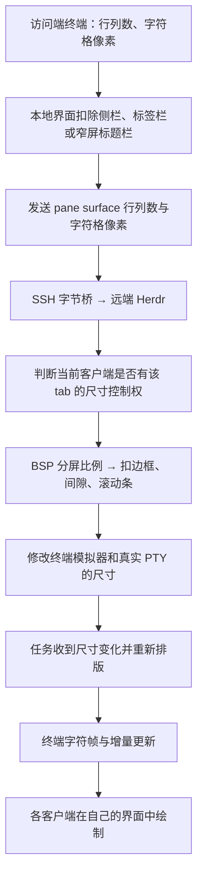

# Herdr 版本兼容与远程终端尺寸调研

本文记录改动前的调研基线；实现后的接入与验收以[实施方案](design/terminal-sizing-and-herdr-compatibility.md)和[验证记录](terminal-sizing-validation-2026-09-20.md)为准。真实整链测试后来确认 CLI observer 画布固定，现已增加只读原生观察画布适配器。

调研日期：2026-09-20。herdrx 基线：`c665c8a`。本报告记录研究结果与建议，不代表新增功能已经实现。

## 结论

Herdr 根据访问端的**字符网格和字符格像素尺寸**重新计算远端终端布局。远程主机是否连接显示器、使用什么显示器分辨率，不参与这个过程。它不为终端同步字体，也不把远端画面按 16:9、4:3 等屏幕比例整体缩放。

同一个 pane 的任务只有一份真实 PTY 尺寸。多个原生客户端查看它时，尺寸控制主要以 **tab** 为单位仲裁；不同客户端看不同 tab 可以各自适配，同 tab 的多个客户端不能同时让同一个任务拥有不同的真实行列数。

herdrx 需要持续管理 Herdr **兼容性**，但网站仍不代管远程 Herdr 的安装、升级、重启。当前网页使用的 `terminal session observe/control` 与 Herdr 原生客户端的 `ClientShell` 不是同一条接入路径；升级 Herdr 不会自动让网页获得原生客户端的全部尺寸协商能力。

## 研究范围与证据

- 克隆官方源码为只读参考仓库，固定正式版 [v0.9.1 / 065ef9d6](https://github.com/herdrdev/herdr/tree/065ef9d6a531c49fb8bee7e818ef837065b21ee9)。调研时 GitHub latest 为 v0.9.1，发布时间为 2026-09-16 18:40 UTC。
- 对照当时 [master / 29f9f405](https://github.com/herdrdev/herdr/tree/29f9f4056f344af60f411004fc89c7eb5f357c48)。下文源码链接固定到 v0.9.1，避免移动分支改变证据。
- 三个 Agent 分别追踪客户端几何与协议、多客户端尺寸仲裁、远程 SSH 与画面传输。主任务交叉复核，并执行隔离的真实二进制实验。
- 下载官方 Linux amd64 0.9.0、0.9.1 二进制，分别校验 GitHub Release 提供的 SHA-256；没有替换用户安装的 Herdr。
- 使用临时配置、命名会话、PTY 与测试任务。没有连接用户已有会话或真实远程主机，没有升级、重启用户实例。

## 1. 远程连接中尺寸来自哪里

| 方式 | TUI 在哪里运行 | 几何来源与传递 |
|---|---|---|
| 先 `ssh host`，再运行 `herdr` | 远端 SSH 终端中 | 外层 SSH 传递终端窗口变化，远端 Herdr 客户端读取该终端的尺寸 |
| 本地 `herdr --remote host` | 访问端机器 | 本地读取窗口几何，通过 Herdr 协议传给远端 |
| 原生界面的 saved SSH machines | 访问端机器 | 本地统一界面；选中的远端接收 surface 尺寸与输入，后台远端保留状态连接 |
| `herdr --machine <label> agent list` 等命令 | CLI 命令调用端 | API 路由，不是一个终端显示客户端，不能据此推断会接管尺寸 |

官方 `--remote` / saved SSH 的 transport 使用 **`ssh -T`**，不分配 SSH PTY。远端 bridge 把 stdin/stdout 连接到已经运行的 Herdr socket，因此这一条路径的尺寸由 Herdr 显式传输，而不是从远程主机显示设备获得。证据：[SSH bridge](https://github.com/herdrdev/herdr/blob/v0.9.1/src/remote/attach.rs#L2710)、[远端 bridge](https://github.com/herdrdev/herdr/blob/v0.9.1/src/remote/host.rs#L6)。



## 2. 如何处理不同窗口、字体与分屏比例

### 2.1 行列数与像素是两组数据

客户端通过终端接口读取 `cols`、`rows`、窗口像素宽高，由此得到 `cell_width_px`、`cell_height_px`。握手后每 100 ms 轮询，并监听窗口尺寸变化信号。行列不变但字符格像素变化，也会触发上报。[几何采集与检测](https://github.com/herdrdev/herdr/blob/v0.9.1/src/client/terminal_geometry.rs#L14)

同一次 ioctl 同时获得有效网格和像素数据时标为精确几何；无法获取像素时，仍能使用行列数。字符格可按查询回复、上次有效值、8×16 默认值降级，但降级不等于具备精确像素鼠标能力。

字号和字体由访问端终端控制；握手没有“远端显示器分辨率”或“同步字体名称”字段。图像和像素鼠标会用到字符格像素数据，不能只保留行列数就宣称支持全部原生能力。

### 2.2 窄屏改变界面布局，不改变字体

默认宽度 ≤64 列时，原生界面隐藏桌面侧栏与标签栏，预留两行窄屏标题栏；桌面布局则先扣除侧栏和标签栏。侧栏宽度、折叠方式和标签栏显示可配置。[布局计算](https://github.com/herdrdev/herdr/blob/v0.9.1/src/client/shell/config.rs#L360)

远端收到的是剩余 pane surface 的行列数。BSP 再按照分割比例计算 pane 矩形，例如横分 `round(可用列数 × ratio)`，剩余列数给另一个 pane。它保留分割比例，不保持 pane 的物理像素宽高比。[BSP 计算](https://github.com/herdrdev/herdr/blob/v0.9.1/src/layout.rs#L691)

pane 矩形还要扣边框、间隙；普通屏幕通常再留一列滚动条，alternate screen 可以收回这一列。因此 snapshot 的外层 pane 矩形不能直接当作真实 PTY 行列。[终端内部矩形](https://github.com/herdrdev/herdr/blob/v0.9.1/src/ui/panes.rs#L36)

### 2.3 最终调整真实终端

Herdr 同时调整终端模拟器和 PTY。Unix 最终调用 `TIOCSWINSZ`：

```text
ws_col    = pane 内部列数
ws_row    = pane 内部行数
ws_xpixel = 列数 × 字符格像素宽度
ws_ypixel = 行数 × 字符格像素高度
```

实际像素 extent 会限制到 u16 范围；pane 最小运行时网格为 4 列×2 行。终端尺寸改变后，应用可收到 SIGWINCH 并重绘，终端模拟器也可能重排历史内容。这是程序布局变化，不是位图缩放。[runtime resize](https://github.com/herdrdev/herdr/blob/v0.9.1/src/pane.rs#L2909)、[PTY ioctl](https://github.com/herdrdev/herdr/blob/v0.9.1/src/pty/fd.rs#L220)

像素鼠标先换算成 pane 内字符格与格内偏移，再映射到目标字符格像素；远端会验证随事件携带的几何，过期时降级为字符格坐标，避免用旧尺寸误点。[坐标映射](https://github.com/herdrdev/herdr/blob/v0.9.1/src/input/mouse.rs#L59)、[远端校验](https://github.com/herdrdev/herdr/blob/v0.9.1/src/server/pane_input.rs#L6)

## 3. 多台客户端同时访问时谁决定尺寸

`tab_geometry_controllers` 保存每个 tab 的尺寸控制者。全局 foreground 与尺寸控制者是不同状态，不能因为某客户端成为 foreground 就认为它已经改变 PTY。

| 场景或事件 | 原生 ClientShell 行为 |
|---|---|
| 同一 pane，多个客户端 | 一份 PTY 网格，由所属 tab 的控制者决定 |
| 同一 tab，不同 pane | 仍共享该 tab 的控制者，按 BSP 比例分配尺寸 |
| 不同 tab，包括不同 workspace | 各 tab 可由不同客户端控制 |
| 不同远程主机 | 各主机独立仲裁，不存在跨主机取最小窗口 |
| 非控制者仅 resize 窗口 | 改自己的画布；不立即改变该 tab 的 PTY |
| 有效输入、鼠标交互或获得焦点 | 可以取得当前 tab 的控制权，再按其窗口调整 PTY |
| 重复上报同一个 `focused:true` | 被忽略；真实失焦再获焦才构成新的焦点变化 |
| 普通协议连接刚建立 | 只认领无人控制的 tab；但这不是官方客户端启动的完整流程 |
| 官方 TUI 新启动 | 还会主动发送 `ClientShellFocus{focused:true}`，因此实际后接入可改变已有 tab 尺寸 |
| 只剩一个活跃原生 shell | 按它的尺寸重新布局各 workspace/tab；缩放 pane 和 direct-control 锁有例外 |
| 所有客户端退出 | 已有任务继续；本轮实验中 PTY 保留最后尺寸 |

证据：[认领与 resize](https://github.com/herdrdev/herdr/blob/v0.9.1/src/server/headless/client_views.rs#L689)、[输入与焦点处理](https://github.com/herdrdev/herdr/blob/v0.9.1/src/server/headless.rs#L2324)、[官方客户端启动焦点](https://github.com/herdrdev/herdr/blob/v0.9.1/src/client/mod.rs#L533)。非 release 鼠标事件也可算交互，不能只概括为“最后键盘输入者”。

“只剩一个客户端”的同步有边界：zoomed tab 只调整其聚焦 pane，direct controller 锁定的 terminal 不被 shell 布局改动。若原 controller 退出后仍剩多个 shell，删除连接路径不保证立即为所有失去 controller 的 tab 选出继任者；可能等待下一次交互或重新应用布局。后一项为静态发现，未单独动态复现。[单客户端处理](https://github.com/herdrdev/herdr/blob/v0.9.1/src/server/headless/client_views.rs#L561)、[resize lock](https://github.com/herdrdev/herdr/blob/v0.9.1/src/ui/panes.rs#L207)

### 非控制者看到什么

服务器为每个客户端绘制符合其画布大小的 surface，但旁观者绘制不会反复 resize 同一 PTY。真实终端比画布大时，从左上角显示并裁掉超出右侧、底部的内容；画布更大时补空白。不会为同一任务给每个客户端单独重新换行，也不自动把大终端缩成小图。[每客户端渲染](https://github.com/herdrdev/herdr/blob/v0.9.1/src/server/headless/render.rs#L461)、[裁剪与补空白](https://github.com/herdrdev/herdr/blob/v0.9.1/src/pane/terminal.rs#L2357)

## 4. 切换机器与重连

saved SSH endpoint 的后台连接使用 `surface_active=false`，可以继续获取状态，但不提供活跃画面、不据此修改任务几何。切入机器时，先发最新 resize，再激活 surface，随后同步焦点，并等待与 boot/generation/revision 和目标尺寸匹配的快照与画面；切换期间再次 resize 会使旧画面证据失效。[后台握手](https://github.com/herdrdev/herdr/blob/v0.9.1/src/client/endpoint/supervisor.rs#L280)、[激活顺序](https://github.com/herdrdev/herdr/blob/v0.9.1/src/client/endpoint/activation/protocol.rs#L109)

后台激活本身还会保护同 tab 已获得焦点的 viewer，避免短暂抢尺寸；后续真实焦点、输入仍按前述规则仲裁。切出时撤销 surface interest，释放对应几何控制并停止画面传输，不结束 pane 内任务。[远端 surface 生命周期](https://github.com/herdrdev/herdr/blob/v0.9.1/src/server/headless/surface_interest.rs#L9)

这里不能把“后台连接不抢尺寸”扩大成“切入远端不抢尺寸”：`--remote` 启动的也是会主动发初始 `Focus(true)` 的客户端；saved machine 激活后会发送当前 host focus，未知时默认 true。因此正常选中远端仍可能取得同 tab 尺寸控制权；实际 host focus=false 且已有其他 focused viewer 时才受到前述保护。[远程客户端启动](https://github.com/herdrdev/herdr/blob/v0.9.1/src/remote/attach.rs#L3035)、[saved endpoint 焦点默认值](https://github.com/herdrdev/herdr/blob/v0.9.1/src/client/shell/endpoints.rs#L413)

断开 SSH bridge 只结束访问连接。远端 Herdr daemon 与任务独立存活；已经不存在的 daemon 的冷启动和会话恢复是另一个场景，不能用它替代任务存活保证。

## 5. 本轮实际执行的验证

### 5.1 现有 herdrx 与正式版兼容性

对官方 Herdr 0.9.0 和 0.9.1，分别执行：

```sh
HERDRX_TEST_HERDR=/path/to/isolated/herdr go test -v -count=1 -timeout=4m \
  ./internal/herdr ./internal/httpapi -run 'WithRealHerdr$'
```

两版各 **7 个顶层测试通过**，其中滚动闪烁测试各含两个子场景。覆盖原始输入（含中文）、提交组合、SGR 滚轮、真实像素尺寸与分屏、浏览器协议到真实 Herdr 的显式自适应，以及断开后任务存活。没有执行整仓库完整门禁，因为本轮没有修改产品代码。

这补充了原有“0.8.2 真实运行、协议 22 仅报文样例”的历史记录，但不等于 0.9.x 已完成所有平台和真实跨网验收。

### 5.2 原生双客户端尺寸实验

同一隔离 Herdr 0.9.1 daemon，两个真实 TUI 客户端分别运行在合成 PTY 中。测试应用通过 `TIOCGWINSZ` 记录真实行列、像素 extent、PID 和 SIGWINCH；持续读取原生界面输出并回复终端几何查询。下表统一写为**列×行**。

| 操作 | 任务实际 PTY 网格 | 任务像素 extent |
|---|---|---|
| A：160×50，字符格 8×16，接入 | 133×49 | 1064×784 |
| B：50×40，字符格 10×20，后接入 | 49×38 | 490×760 |
| A 仅将窗口放大到 180×55 | 仍为 49×38 | 仍为 490×760 |
| A 输入一个字符 | 153×54 | 1224×864 |
| B 仅将窗口改为 100×35 | 仍为 153×54 | 仍为 1224×864 |
| B 失焦后重新获焦 | 73×34 | 730×680 |
| A 再输入 | 153×54 | 1224×864 |
| A 断开，仅剩 B | 73×34 | 730×680 |
| B 也断开 | 保留 73×34，任务 PID 不变 | 保留 730×680 |

50 列的 B 进入原生窄屏布局：两行标题栏，再扣普通终端的一列滚动条，得到 49×38。A 和较宽的 B 则使用桌面侧栏布局。另一次以 B=80×30 执行相同步骤，接入后得到 53×29，后续控制权行为一致。

实验还复现了一个重要细节：B 首次接入即改变尺寸，因为真实客户端除了连接，还主动上报初始焦点；若只阅读服务端 `claim_unowned` 会得出不完整结论。

**验证边界：**这些是 Linux amd64 上真实 Herdr 二进制与合成终端的本地实验。SSH 字节桥与远程尺寸链路做了源码追踪，没有执行真实跨网、实体手机、Mac Retina 或 Windows 缩放验收。上游 Rust 测试仅阅读其覆盖内容，本轮未编译运行。

## 6. herdrx 当前与原生机制的差别

| 项目 | Herdr 原生 ClientShell | herdrx 当前实现 |
|---|---|---|
| 接入方式 | stable endpoint generation 1，协商 codecs/methods/capabilities | CLI `terminal session observe/control`；普通滚动还有私有二进制适配 |
| 默认显示 | 按当前客户端布局，并参与 tab 几何仲裁 | 桌面 `auto`，手机 `fixed`；默认观察，不自动控制远端尺寸 |
| 适应小窗口 | 窄屏界面 + 有控制权时重算 PTY | `fit` 调整本地字号；`auto` 字号低于 10px 时转为固定字号裁切；`responsive` 才调整远端 PTY |
| 多客户端控制 | 同 tab 的焦点/交互可交接尺寸权 | 同一 terminal 的 direct controller 默认只允许一个；第二个自适应连接不能直接接管 |
| 像素尺寸 | 协议携带字符格像素 | Web resize 当前仅传 `cols/rows`，未传字符格像素 |

本项目依据：[默认模式与不恢复远端 resize 偏好](../web/src/lib/displayPreferences.ts)、[字体适应和行列计算](../web/src/lib/terminalFit.ts)、[终端显示流程](../web/src/components/TerminalPane.tsx)、[Web 观察/控制与 resize](../internal/httpapi/workbench.go)、[私有滚动协议](../internal/herdr/native_scroll.go)。

Direct control 会为对应 terminal 加 resize lock，原生 shell 不再随自己的布局修改该 terminal；这也意味着网页主动自适应会影响原生窗口看到的共享任务。`takeover=false` 保护的是另一个 direct controller，不是保证“不会影响原生 TUI”。[上游 direct control](https://github.com/herdrdev/herdr/blob/v0.9.1/src/server/headless.rs#L1848)

上游 JSON `terminal.resize` 支持可选 `cell_width_px/cell_height_px`，缺省为零；但此路径生成消息时仍固定 `pixel_mouse=false`。因此可以研究补齐像素几何，不能将其等同于实现 ClientShell 的语义像素鼠标。浏览器 CSS 像素与设备像素如何对应，需要针对真实 xterm 测量另行设计和验证，不能简单乘 DPR。[JSON resize 定义](https://github.com/herdrdev/herdr/blob/v0.9.1/src/client/terminal_sessions.rs#L167)

## 7. 版本与特性跟进建议

### 优先补齐兼容性管理

1. **固定版本回归矩阵。** 保留已验证的旧版本基线，将 0.9.1 纳入真实实例 CI；现有 CI 没有安装 Herdr，也没有设置 `HERDRX_TEST_HERDR`，相关测试默认跳过。测试要覆盖多种尺寸、原生与 Web 同时连接、SSH/Tailcat、断开恢复和滚动。
2. **分开识别安装的 CLI 与正在运行的 daemon。** 当前 preflight 主要检查 CLI 版本、它自带的 schema 和 socket 连通；不能证明后台 daemon 与二进制能力一致。补充 live `ping` / snapshot 的版本、私有协议和能力检查，在连接详情说明已验证、部分支持或未知版本。
3. **按功能降级。** 当前私有滚动明确只接受协议 20/22。未知版本应保持已验证的安全失败路径，并准确说明受影响功能；不要让“更新到最新 Herdr”成为通用修复提示。
4. **保留生命周期边界。** 网站继续只管理访问兼容性，不自动下载、升级、停止 Herdr；不自动执行实验性 live handoff。

### 与尺寸有关，值得跟进的能力

- 明确展示“保持远端尺寸”与“由此窗口控制尺寸”的差别；切换网页、重新登录或打开 PWA 不应隐式抢尺寸。原生客户端启动自动 focus 的行为不能直接照搬到 herdrx 默认观察流程。
- 评估更明确的尺寸控制者状态、冲突说明和主动交接流程，覆盖网页与原生 TUI 并存。
- 把 ClientShell generation 1 作为独立原型调研：它提供能力协商、客户端独立 view、后台 surface 停发和带代际的画面，但需要接入新的快照、画面和输入模型，不是把私有协议号换一个常量。
- 评估公开 `pane.scroll` 用于历史定位。其参数是 `offset_from_bottom`，只调整终端历史偏移，**不能直接替代** Neovim 等应用接收的鼠标滚轮路由。[API 定义](https://github.com/herdrdev/herdr/blob/v0.9.1/src/api/schema/panes.rs#L246)、[实现](https://github.com/herdrdev/herdr/blob/v0.9.1/src/app/api/panes.rs#L170)

### 无需逐项照搬的新功能

0.9.0 的原生多机器管理、0.9.1 的 `--machine` CLI 转发与原生 TUI 主题/侧栏功能，不要求 herdrx 一比一复制；herdrx 已有自身的多用户、多主机和浏览器界面。Agent 状态识别改进可通过已有 snapshot 受益，但新增 Agent 的结构化聊天日志解码仍需独立适配，不能将“能显示 Agent 名称”当成“支持它的聊天记录”。参见 [0.9.0 发布说明](https://github.com/herdrdev/herdr/releases/tag/v0.9.0)、[0.9.1 发布说明](https://github.com/herdrdev/herdr/releases/tag/v0.9.1)。

本次对照的 master 没有改变上述核心尺寸采集、按 tab 仲裁、PTY resize 和裁剪规则；邻近更新主要涉及其他 UI、SSH 元数据和 Windows 输入。当前没有发现必须追 master 才能得到的新“屏幕比例适配”。

## 8. 后续验收清单（未执行）

- [ ] 0.9.1 的真实 SSH 与 Tailcat 路径执行同一套尺寸仲裁回归。
- [ ] 两个客户端查看不同 tab、同 tab 不同 pane，以及三个以上客户端退出 owner 的动态实验。
- [ ] 实体手机横竖屏、软键盘和 PWA，Mac Retina/不同字体尺寸的像素几何验证。
- [ ] 多 Web 自适应窗口与原生 TUI 的尺寸交接、direct control 退出后恢复。
- [ ] 慢消费者被上游断开且没有最终 `terminal.closed` 时，Web 正确提示并重新连接原会话。
- [ ] 将支持矩阵和 live daemon 能力检查落入产品与 CI。

官方接口稳定性说明：[Socket API / Protocol stability](https://herdr.dev/docs/socket-api/#protocol-stability)。该说明明确区分 stable endpoint generation 与 direct terminal 的私有数字协议；原生端点兼容不等于所有 Herdr 接入方式都可以任意混用版本。
